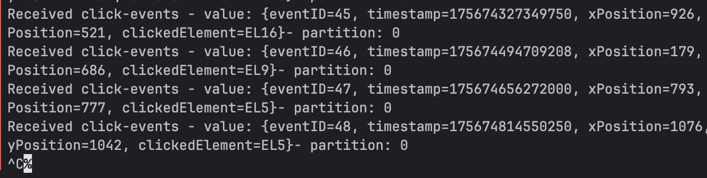
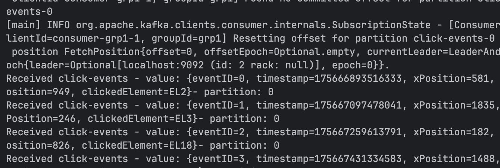
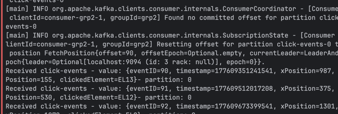
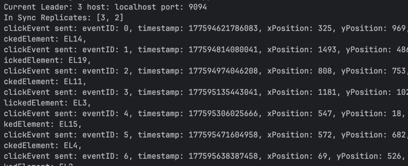

# Experiments with Kafka
> [!NOTE]
> The full runnable setups live in the subdirectories referenced below.
> This file consolidates the insights that are documented there so the hand-in captures every experiment outcome in one place.

Project Link: [https://github.com/cyrilgabriele/EDPO-Project-FS26/tree/main/assignments/ex-1](https://github.com/cyrilgabriele/EDPO-Project-FS26/tree/main/assignments/ex-1)

---

## Producer Experiments (`./producer-experiments`)

### Infrastructure and Code

- Based on the [lab02Part3-ManyBrokers](https://github.com/scs-edpo/lab02Part3-ManyBrokers) stack, trimmed to `controller`, `kafka1`, and `kafka2` as defined in `producer-experiments/docker-compose.yml`.
- `ClickStream-Producer` emits one event roughly every 150 ms with `acks=0`, `retries=0`, and no idempotence.
- `ClickStream-Consumer` continuously logs the payloads from `click-events`.

### Tutorial — Message Loss with `acks=0` and `retries=0`

**Goal:** Show that disabling acknowledgments and retries results in permanent data loss when the leader crashes.

**Procedure:**
1. `cd assignments/ex-1/producer-experiments && docker compose up -d` — start controller + two brokers.
2. Launch the producer and consumer run configurations from IntelliJ.
3. Determine the active leader via `kafka-topics --describe` and stop that broker (e.g., `docker stop producer-experiments-kafka1-1`).

**Observed behavior:**

Producer log:
```text
clickEvent sent: eventID: 75, timestamp: ..., xPosition: 201, yPosition: 592, clickedElement: EL6,
clickEvent sent: eventID: 76, timestamp: ..., xPosition: 412, yPosition: 795, clickedElement: EL9,
Current Leader: 2 host: localhost port: 9092
In Sync Replicates: [2]
clickEvent sent: eventID: 77, timestamp: ..., xPosition: 606, yPosition: 1025, clickedElement: EL9,
```

Consumer log:
```text
Received click-events - value: {eventID=75, ...} - partition: 0
Received click-events - value: {eventID=77, ...} - partition: 0
Received click-events - value: {eventID=78, ...} - partition: 0
```

`eventID=76` was sent by the producer but never appeared in the consumer — it is gone permanently.

**Insights:**
- With `acks=0` the client fire-and-forgets; Kafka may never receive the record, yet the application cannot tell.
- `retries=0` eliminates the chance to resend while the leader is down.
- Remediation requires at least `acks=all`, `retries > 0`, and ideally `enable.idempotence=true` to regain durability without introducing duplicates.

---

## Consumer Experiments (`./consumer-experiments`)

### Shared Preparation

- Topic `click-events` with a single partition is created by the provided producer.
- Producer emits ordered `eventID` values `1..20` (and beyond) before each test.
- Consumers log every `eventID`. When expecting `auto.offset.reset` to apply, a fresh `group.id` is configured in `consumer.properties`.

### Experiment A — Safe Replay with `auto.offset.reset=earliest`

**Goal:** Confirm that when no committed offsets exist, `earliest` forces a full rewind.

**Procedure:**
1. Produce the first batch of events before starting the consumer.
2. Start the consumer with the defaults (`group.id=grp1`, `auto.offset.reset=earliest`).
3. Kill the consumer before it auto-commits (Ctrl+C within five seconds), then restart it unchanged.

**Observed behavior:**



- Shutdown while printing events `45–48` proves offsets were never committed.



- Restart log shows "Resetting offset … offset=0" and the consumer replays from `eventID=0` in order.

**Insights:**
- Within the retention window, missing commits + `earliest` guarantee deterministic replay — ideal for at-least-once processing and disaster recovery.
- Operationally, you must budget for the fact that a restart can take as long as processing the full backlog again.

### Experiment B — History Skipped with `auto.offset.reset=latest`

**Goal:** Show that switching to `latest` causes brand-new consumer groups to miss retained data.

**Procedure:**
1. Keep producing to `click-events` and edit `consumer.properties` to use `group.id=grp2` and `auto.offset.reset=latest`.
2. Start the consumer, observe no records being printed initially, then produce more events.

**Observed behavior:**



- Client joins `grp2` with no offsets and immediately resets to offset 90.



- Producer emits IDs `0..6` before the consumer prints anything; those remain unread by `grp2`.

**Insights:**
- `latest` is unsafe for analytics-style workloads that expect replay of retained data; you must explicitly use `earliest`, manual `seek`, or pre-seed offsets to prevent silent data gaps.
- Even though Kafka retained the skipped records, from the application's perspective the data is "lost."

---

## Fault Tolerance & Reliability (`./fault-tolerance-and-reliability`)

### Infrastructure and Components

- `docker-compose.yml` provisions one KRaft controller plus `kafka1`, `kafka2`, `kafka3` brokers.
- `KAFKA_OFFSETS_TOPIC_REPLICATION_FACTOR=1` keeps consumer group coordination healthy even when brokers are killed during experiments.
- `KAFKA_REPLICA_FETCH_WAIT_MAX_MS=3000` and `KAFKA_REPLICA_FETCH_MIN_BYTES=1048576` slow replication to open a reliable loss window for Tutorial 2.
- `ClickStream-Producer` logs leader/ISR changes and records `ACKED`/`SEND FAILED` events while producing monotonic `eventID`s.
- `ClickStream-Consumer` has `enable.auto.commit=false`, commits explicitly, and reports `GAP DETECTED` log lines for missing IDs.

### Tutorial 1 — Leader Failure and Election Time

**Goal:** Measure the pause between the last ACK before a broker crash and the first ACK after a new leader is elected.

**Procedure:**
1. `cd assignments/ex-1/fault-tolerance-and-reliability && docker compose up -d`
2. Run producer and consumer.
3. Identify the leader via `kafka-topics --describe` and hard-kill the corresponding container:
   ```bash
   docker compose kill -s KILL kafkaX
   ```

**Observed behavior:**
- Last ACK before failure: `id=212` at `18:12:51.570`.
- Leader switched from broker `2` to `3`, detected at `18:13:00.375`.
- Measured timings:
  - `lastAckToLeaderElectedMs=8805`
  - `lastAckToFirstRecoveredAckMs=8890`
  - `firstAckAfterRecoveryMs=85`
- First recovered ACK was `id=213`; consumer processed `211..271` with no gaps.

**Insights:**
- The ~8.9 s outage was purely availability-related — no ACKed data was lost.
- Downtime must be measured from the last successful ACK, not from the leader-election log line; most of the pause happens before the detector fires.
- A temporary consumer pause during failover is expected and does not imply data loss.

### Tutorial 2 — True Loss with `acks=1`

**Goal:** Demonstrate that leader-only acknowledgment loses records when the leader crashes before replication completes.

**Procedure:**
1. Set `acks=1`, `retries=0` in `producer.properties` and restart the producer.
2. Kill the current leader while load is running within ~3 s of the last ACK batch (the deliberate replication lag window).

**Observed behavior:**

Producer log around the failure:
```text
ACKED id=70 partition=0 offset=70
ACKED id=71 partition=0 offset=71
CLICK_EVENT_QUEUED id=72 ...
CLICK_EVENT_QUEUED id=73 ...
```

Consumer log after recovery:
```text
RECEIVED eventID=70 partition=0 offset=70 ...
GAP DETECTED from=71 to=71 previous=70 current=72
RECEIVED eventID=72 partition=0 offset=71 ...
RECEIVED eventID=73 partition=0 offset=72 ...
```

`eventID=71` was ACKed by the leader but never reached the followers before the crash — permanently lost.

**Insights:**
- `acks=1` only guarantees the leader appended the record; it says nothing about replication.
- The `replica.fetch.wait.max.ms=3000` setting in `docker-compose.yml` is what makes the loss window large enough to trigger manually; on a real localhost cluster replication is sub-millisecond.
- Fix: use `acks=all` so the leader waits for all ISR members before ACKing. Add `retries > 0` and `enable.idempotence=true` to avoid duplicates on retry.

---

## Evidence and Reproducibility

Detailed command transcripts, log snippets, screenshots, and configuration files remain in each experiment subdirectory.
To reproduce, follow the step-by-step sections in the respective README files; they include docker compose commands, IntelliJ run configs, and cleanup commands (`docker compose down -v`).
