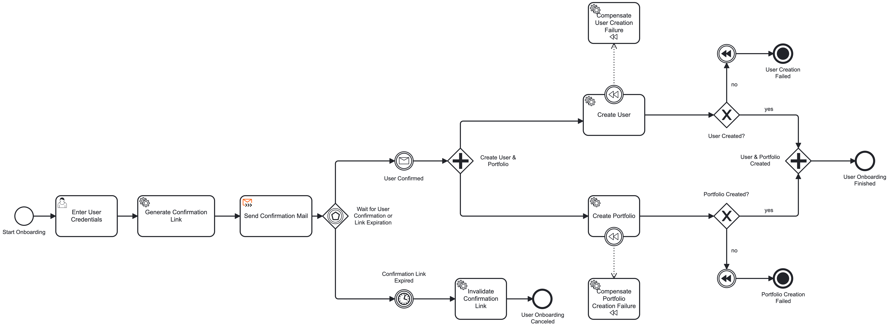
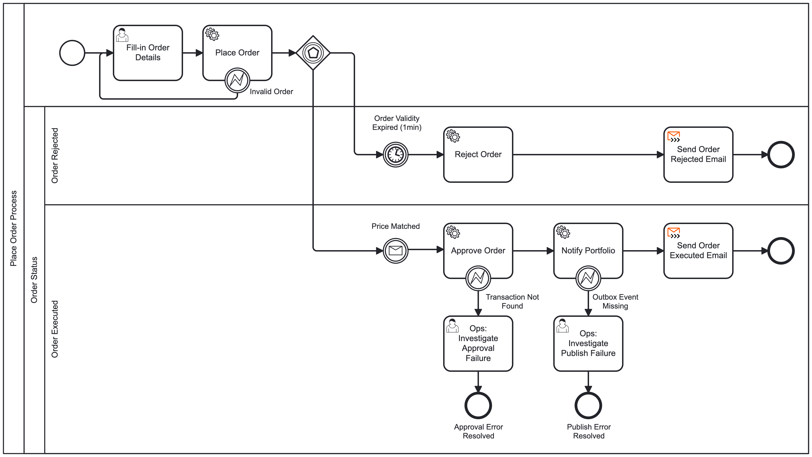

# CryptoFlow BPMN Workflows

> ![NOTE]
>
> This document describes the BPMN processes deployed to Camunda 8 and argues why these
> specific flows are orchestrated rather than handled through Kafka-based choreography.

Project Link: [https://github.com/cyrilgabriele/EDPO-Project-FS26](https://github.com/cyrilgabriele/EDPO-Project-FS26)

The BPMN source files discussed below are committed in this repository and can be imported into
Camunda Web Modeler:

- `onboarding-service/src/main/resources/userOnboarding.bpmn`
- `transaction-service/src/main/resources/placeOrder.bpmn`

## Orchestration vs. choreography — decision criteria

CryptoFlow uses Kafka-based choreography as its default integration style: services publish
and consume events independently, with no central coordinator. This works well for loosely
coupled interactions where each service can react to events autonomously.

Some processes, however, require a different set of trade-offs that choreography cannot
provide efficiently. A process is a candidate for orchestration when it exhibits one or more
of the following characteristics:

- **Long-running waits with correlation** — the process suspends for an unbounded period and
  must correlate a future event back to a specific in-flight instance.
- **Competing outcomes** — the process races multiple possible events (e.g. a success signal
  vs. a timeout) and must branch accordingly.
- **Strict step ordering with compensation** — steps must execute in a defined sequence, and
  failure at any point requires rolling back earlier steps.
- **Operational visibility** — support or operations need to see exactly where an instance is
  stuck without aggregating events across services.

The Camunda workflow engine handles all of the above declaratively: it owns process state, correlates
messages, manages timeouts and branching, and provides an operations dashboard out of the
box. The processes below were modelled as BPMN workflows in Camunda 8 because they match
these criteria.

---

## 1. User Onboarding

### Why orchestration

Registration requires waiting an unbounded amount of time for the user to click a
confirmation link. In the current implementation, `onboarding-service` deploys and owns the
`userOnboarding.bpmn` process, while `user-service` implements the workers that prepare the
confirmation link, invalidate expired links, create the user, and publish the
`UserConfirmedEvent` when the user clicks the link. `portfolio-service` implements the
portfolio creation and portfolio compensation workers. With Kafka choreography, these services
would need shared state to correlate the confirmation click back to the correct registration,
plus separate timeout handling — all without a central view of pending registrations.

As an orchestrated BPMN process, the wait is a simple intermediate message catch event. The
engine tracks every pending registration, correlates `UserConfirmedEvent` by `userId`, and
models the timeout and compensation branches declaratively.

### Model location and ownership

- **BPMN source** — `onboarding-service/src/main/resources/userOnboarding.bpmn`
- **Process owner** — `onboarding-service`
- **Workers in `user-service`** — `prepareUserWorker`, `invalidateConfirmationWorker`,
  `userCreationWorker`, `userCompensationWorker`
- **Workers in `portfolio-service`** — `portfolioCreationWorker`, `portfolioCompensationWorker`
- **Message sender** — `user-service` publishes the confirmation message correlated by `userId`

### Process description

1. **Start event** — a new registration process instance is created.
2. **Enter User Credentials** (user task) — collects username, password, and email.
3. **Generate Confirmation Link** (service task, `prepareUserWorker` in `user-service`) —
   generates a unique `userId`, persists a pending confirmation link, and builds the
   confirmation URL and email body.
4. **Send Confirmation Mail** (email connector) — sends the confirmation email to the user.
5. **Confirmation Mail Sent Gateway** (event-based gateway) — starts a race between the
   confirmation click and an expiry timer.
6. **Wait for Confirmation** (intermediate message catch event) — the process suspends until
   `user-service` publishes `UserConfirmedEvent`, correlated by `userId`.
7. **Confirmation Link Expired** (timer catch event) — fires after 1 minute, triggering
   **Invalidate Confirmation Link** (`invalidateConfirmationWorker` in `user-service`) and the
   **User Onboarding Canceled** end event.
8. **Create User & Portfolio** (parallel gateway) — after confirmation, the process fans out to
   **Create User** (`userCreationWorker` in `user-service`) and **Create Portfolio**
   (`portfolioCreationWorker` in `portfolio-service`).
9. **Success/failure checks** (exclusive gateways) — the workflow inspects
   `isUserCreated` and `isPortfolioCreated` to determine whether both local transactions
   succeeded.
10. **Compensation path** — if one branch fails after the other succeeded, a compensation throw
    event triggers either `userCompensationWorker` or `portfolioCompensationWorker` to delete
    the already-created sibling entity.
11. **End events** — the process ends as **User Onboarding Finished**, **User Creation Failed**,
    **Portfolio Creation Failed**, or **User Onboarding Canceled**.

### Future improvements

- **Production-grade timeout.** Replace the current 1-minute demo timeout with a realistic
  confirmation window (e.g. 24 hours), optionally followed by a reminder email.
- **Duplicate detection.** Add a gateway before the user task to reject already-registered
  email addresses early.
- **Additional onboarding steps.** Extend the parallel saga with follow-up branches such as
  KYC, analytics, or welcome notifications after successful completion.

---

## 2. Place Order

### Why orchestration

An order must wait for a market price to reach the user's target — a wait that can last
seconds to hours and must correlate a specific price event to a specific pending order. In
addition, the flow must race two outcomes: a successful price match or a timeout expiry.

In the current implementation, `transaction-service` deploys `placeOrder.bpmn`, validates the
submitted order in `placeOrderWorker`, stores it as pending, listens to Kafka price events,
and correlates `priceMatchedEvent` back to the process by `transactionId`. With Kafka
choreography alone, the matching state, timeout handling, and follow-up actions would all live
as hand-written coordination code inside `transaction-service`, with no central view of which
orders are pending, matched, expired, or escalated for manual intervention.

As an orchestrated BPMN process, the race is modelled as an event-based gateway — the engine
handles correlation, timeout, and branching declaratively, and every pending order is visible
in the operations dashboard.

### Model location and ownership

- **BPMN source** — `transaction-service/src/main/resources/placeOrder.bpmn`
- **Process owner** — `transaction-service`
- **Workers in `transaction-service`** — `placeOrderWorker`, `rejectOrderWorker`,
  `approveOrderWorker`, `publishOrderApprovedWorker`
- **Message correlation** — `transaction-service` correlates `priceMatchedEvent` by
  `transactionId`

### Process description

The process uses four swim lanes to separate concerns:

1. **Start event** — a new order process instance is created.
2. **Fill-in Order Details** (user task) — collects the crypto symbol, amount, and target
   price.
3. **Place Order** (service task, `placeOrderWorker` in `transaction-service`) — validates the
   input, registers the order as pending, and generates a `transactionId` for downstream
   correlation.
4. **Invalid Order exception** (boundary error event) — if validation fails,
   `placeOrderWorker` throws `INVALID_ORDER` and the BPMN returns the user to the order form
   instead of terminating the process.
5. **Event-based gateway** — the process races two competing events:

   **Path A — Price match (happy path):**
   The process waits for a `priceMatchedEvent` correlated by `transactionId`. When the market
   price meets or beats the target price for the given symbol, the process runs
   **Approve Order** (`approveOrderWorker`), **Notify Portfolio**
   (`publishOrderApprovedWorker`), and then sends an **Order Executed Email**.

   Two implemented exception branches exist on this path:
   - **Transaction Not Found** — a boundary error on **Approve Order** routes the process to the
     **Ops: Investigate Approval Failure** user task.
   - **Outbox Event Missing** — a boundary error on **Notify Portfolio** routes the process to
     the **Ops: Investigate Publish Failure** user task.

   **Path B — Timeout (rejection path):**
   A 1-minute timer fires if no price match occurs within the execution window. The process
   runs **Reject Order** (`rejectOrderWorker`) and then sends an **Order Rejected Email**
   notifying the user that the order could not be filled in time.

6. **End events** — the process ends after successful execution, timeout rejection, or manual
   ops resolution of an approval/publish failure.

### Future improvements

- **Configurable execution window.** Let users choose their own timeout duration per order
  instead of a fixed 1 minute.
- **Partial fills and order types.** Extend matching to support partial quantity fills and
  differentiate between market, limit, and stop-loss orders.
- **Richer ops recovery.** Let the operator decide whether to retry, cancel, or repair the
  order after approval/publish failures instead of ending the process after manual review.
