# Market Scout To Transaction Kafka Event Flow

This diagram shows the high-level event flow that matters for matching a user
buy bid with a market ask.

```mermaid
graph LR
    Ingestion["market-partial-book-ingestion-service"]
    Scout["market-order-scout-service"]
    Transaction["transaction-service"]
    Camunda["Camunda placeOrder process"]

    Raw["crypto.scout.raw<br/>RawOrderBookDepthEvent"]
    MatchableAsks["crypto.scout.matchable-asks<br/>MatchableAsk"]
    BuyBids["transaction.buy-bids<br/>BuyBid"]
    OrderMatched["transaction.order-matched<br/>OrderMatched"]

    Ingestion -->|publishes raw order book events| Raw
    Raw -->|consumes| Scout
    Scout -->|publishes normalized asks| MatchableAsks

    Camunda -->|placeOrderWorker creates pending order| Transaction
    Transaction -->|publishes bid| BuyBids
    BuyBids -->|consumes| Transaction
    MatchableAsks -->|consumes| Transaction

    Transaction -->|emits match| OrderMatched
    OrderMatched -->|priceMatchedEvent by transactionId| Camunda

    style Raw fill:#e8f5e9,stroke:#2e7d32,stroke-width:2px
    style MatchableAsks fill:#e3f2fd,stroke:#1565c0,stroke-width:2px
    style BuyBids fill:#fff8e1,stroke:#ef6c00,stroke-width:2px
    style OrderMatched fill:#f3e5f5,stroke:#6a1b9a,stroke-width:2px
```



## Matching Boundary

`market-order-scout-service` does not decide whether a user order should be
executed. It only publishes normalized ask-side events.

`transaction-service` owns the matching decision. Its Kafka Streams topology
consumes `transaction.buy-bids` and `crypto.scout.matchable-asks`, stores
pending bids by symbol, and emits `transaction.order-matched` when a newly
arriving ask can satisfy a pending bid.

Current match rules:

```text
ask.eventTime >= bid.createdAt
ask.eventTime <= bid.createdAt + validityWindow
bid.bidPrice >= ask.askPrice
bid.bidQuantity <= ask.askQuantity
```

The emitted `OrderMatched` event is consumed by `transaction-service` again to
publish the Camunda `priceMatchedEvent` message correlated by `transactionId`.

## Omitted From This View

`market-order-scout-service` also publishes `crypto.scout.ask-quotes`,
`crypto.scout.ask-opportunities`, and `crypto.scout.window-summary`. Those
topics support scout diagnostics, threshold demonstrations, and dashboard
summaries; they are not consumed by the transaction matcher.

After Camunda receives `priceMatchedEvent`, the workflow can approve the order
and publish `transaction.order.approved` for `portfolio-service`. That
downstream approval flow is outside the bid/ask matching boundary shown here.
