# Market Scout To Transaction Kafka Event Flow

This diagram shows the high-level event flow from Binance partial-depth ingestion
through Market Scout and into the transaction matching process.

```mermaid
graph LR
    Binance["Binance USD-M<br/>Partial Book Depth"]
    Ingestion["market-partial-book-ingestion-service"]
    Scout["market-order-scout-service<br/>Kafka Streams"]
    Transaction["transaction-service<br/>Kafka Streams matcher"]
    Camunda["Camunda<br/>placeOrder process"]
    Portfolio["portfolio-service"]

    Raw["crypto.scout.raw<br/>RawOrderBookDepthEvent JSON<br/>key = symbol"]
    AskQuotes["crypto.scout.ask-quotes<br/>AskQuote Avro<br/>key = symbol"]
    MatchableAsks["crypto.scout.matchable-asks<br/>MatchableAsk Avro<br/>key = symbol"]
    AskOpps["crypto.scout.ask-opportunities<br/>AskOpportunity Avro<br/>key = symbol"]
    WindowSummary["crypto.scout.window-summary<br/>ScoutWindowSummary Avro<br/>key = symbol"]
    BuyBids["transaction.buy-bids<br/>BuyBid Avro<br/>key = symbol"]
    OrderMatched["transaction.order-matched<br/>OrderMatched Avro<br/>key = transactionId"]
    OrderApproved["transaction.order.approved<br/>OrderApprovedEvent JSON"]

    Binance -->|WebSocket updates| Ingestion
    Ingestion -->|publishes raw snapshots| Raw
    Raw -->|consumes| Scout

    Scout -->|publishes every ask level| AskQuotes
    Scout -->|publishes matching contract| MatchableAsks
    Scout -->|publishes threshold hits| AskOpps
    Scout -->|publishes window summaries| WindowSummary

    Camunda -->|placeOrderWorker validates and persists PENDING order| Transaction
    Transaction -->|publishes bid candidate| BuyBids
    BuyBids -->|consumes| Transaction
    MatchableAsks -->|consumes| Transaction

    Transaction -->|allocates ask to pending bid| OrderMatched
    OrderMatched -->|Kafka listener sends priceMatchedEvent| Camunda
    Camunda -->|approveOrderWorker and outbox publish| OrderApproved
    OrderApproved -->|consumes approved order| Portfolio

    style Raw fill:#e8f5e9,stroke:#2e7d32,stroke-width:2px
    style MatchableAsks fill:#e3f2fd,stroke:#1565c0,stroke-width:2px
    style BuyBids fill:#fff8e1,stroke:#ef6c00,stroke-width:2px
    style OrderMatched fill:#f3e5f5,stroke:#6a1b9a,stroke-width:2px
    style OrderApproved fill:#ede7f6,stroke:#4527a0,stroke-width:2px
```



## Matching Boundary

`market-order-scout-service` does not decide whether a user order should be
executed. It only publishes normalized ask-side events.

`transaction-service` owns the matching decision. Its Kafka Streams topology
consumes `transaction.buy-bids` and `crypto.scout.matchable-asks`, stores
pending bids by symbol, and emits `transaction.order-matched` when a newly
arriving ask can satisfy a pending bid.

Current match rules:

```text
ask.eventTime >= bid.createdAt
ask.eventTime <= bid.createdAt + validityWindow
bid.bidPrice >= ask.askPrice
bid.bidQuantity <= ask.askQuantity
```

The emitted `OrderMatched` event is consumed by `transaction-service` again to
publish the Camunda `priceMatchedEvent` message correlated by `transactionId`.
