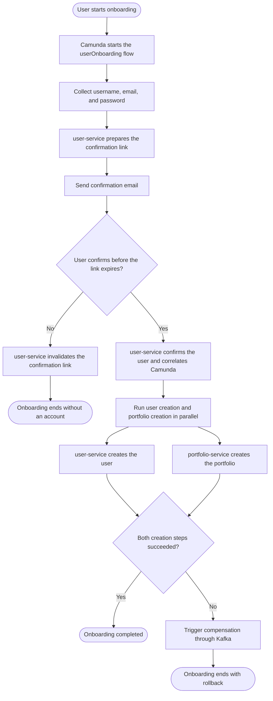
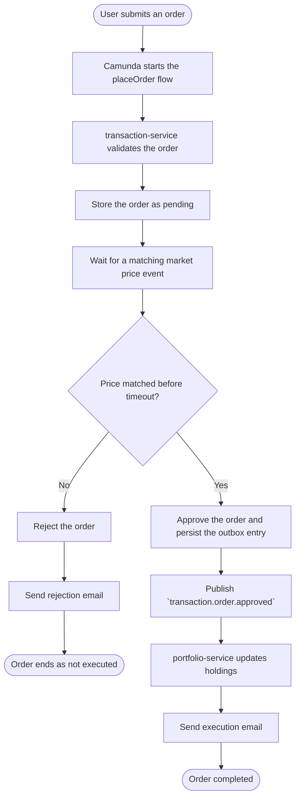
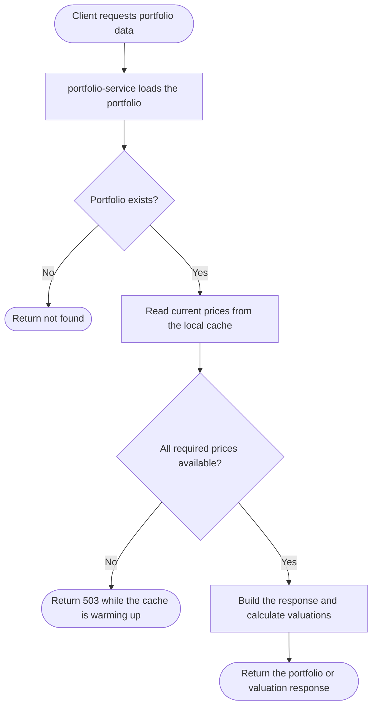

# Activity Diagrams

These diagrams show the current high-level business workflows in this branch. They intentionally avoid low-level transport, retry, and broker details.

## 1. User Onboarding

## 2. Order Placement

## 3. Portfolio Read and Valuation

