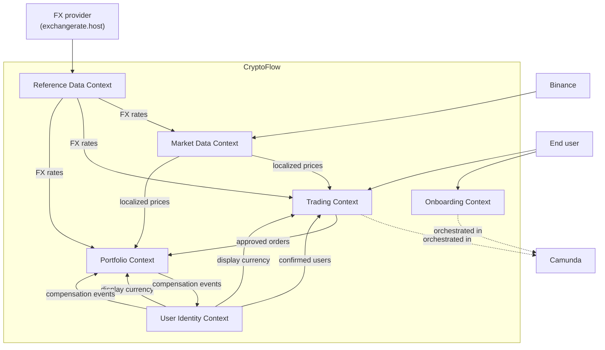
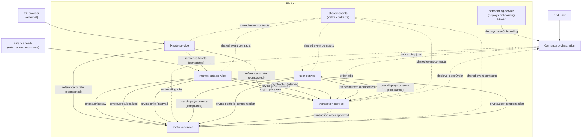

# Context Map

## Bounded Context View

Notes:

- `Market Data Context` owns market-price ingestion and publication, and (per ADR-0030) the stream-side enrichment that joins prices against FX rates into `crypto.price.localized`.
- `Reference Data Context` owns slow-moving externally-sourced facts such as FX rates (see ADR-0029); it is currently realised by `fx-rate-service`.
- `User Identity Context` owns users, confirmation state, confirmed-user events, and the per-user **Display Currency** (see ADR-0028).
- `Onboarding Context` coordinates the registration flow across user and portfolio creation.
- `Trading Context` owns pending orders, matching, and order approval; it converts buy-time quotes to the user's Display Currency at API read time.
- `Portfolio Context` owns holdings, valuation, and the local price read model; it converts portfolio totals to the user's Display Currency at API read time.

## Overview

## Notes

- `market-data-service` ingests Binance market feeds, publishes raw price data, and hosts the scope-03 streams module that emits `crypto.price.localized` (Avro per ADR-0032). It also hosts the scope-05 OHLC streams module that emits `crypto.ohlc.{1m,5m,1h}` (USDT-denominated, per ADR-0031).
- `fx-rate-service` polls a public FX provider on a 5-minute timer and publishes `reference.fx.rate` (compacted, Avro). It is the only producer in the Reference Data context (ADR-0029).
- `user-service` publishes `user.confirmed`; `transaction-service` keeps a local confirmed-user read model from that compacted topic.
- `user-service` additionally publishes `user.display-currency` (compacted, Avro) on user creation and on every `PATCH /users/{id}/display-currency`. Both `portfolio-service` and `transaction-service` materialise it as a KTable to convert values at API read time (ADR-0028).
- `portfolio-service` consumes price updates (`crypto.price.localized`), approved-order events, and `user.display-currency` to render per-user portfolio values.
- `transaction-service` consumes `crypto.price.localized` and `user.display-currency` to render buy-time quotes in the user's Display Currency. Order placement itself remains USDT-internal.
- `onboarding-service` deploys the onboarding BPMN, while `transaction-service` deploys and runs the order workflow.
- `Camunda` coordinates the `userOnboarding` and `placeOrder` flows across the participating services.
- Compensation between `user-service` and `portfolio-service` is handled asynchronously through Kafka topics.
- Schema Registry (`http://schema-registry:8081` inside the Docker network, `http://localhost:8090` from the host) is part of the Kafka platform, not shown in the context diagrams; it is the runtime contract surface for all Avro topics introduced by ADRs 0028 through 0032.
