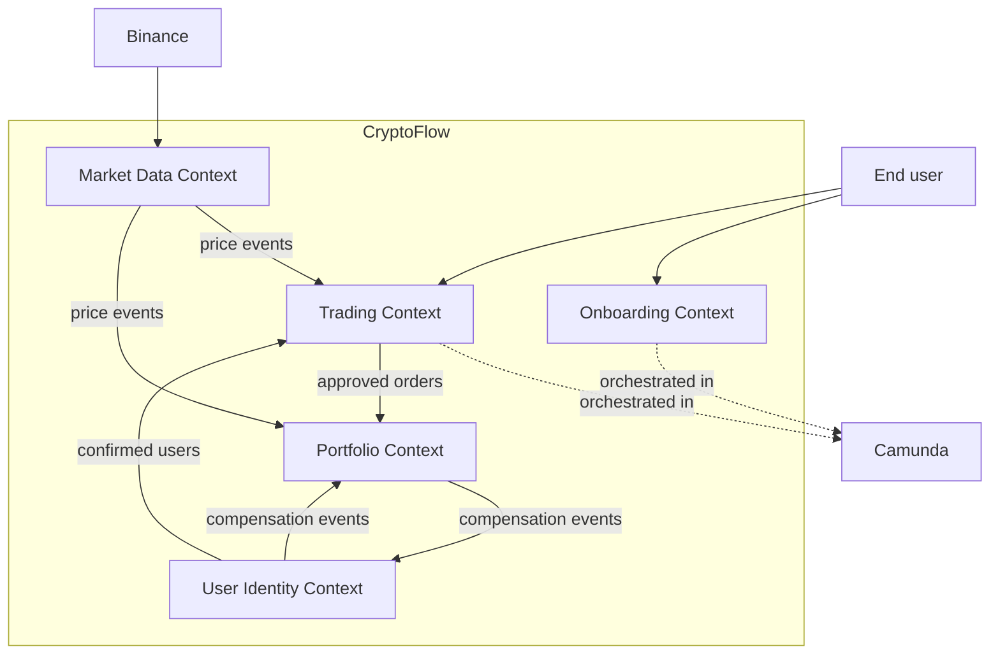
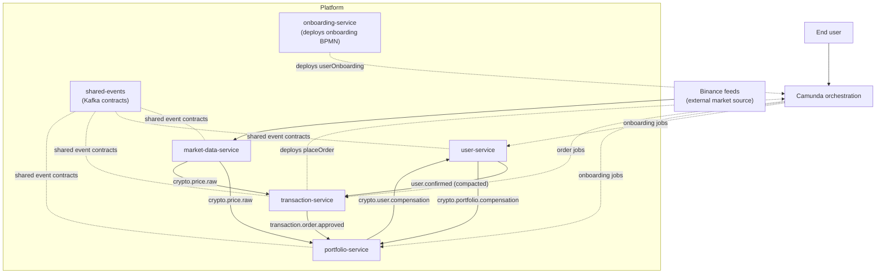

# Context Map

## Bounded Context View

Notes:

- `Market Data Context` owns market-price ingestion and publication.
- `User Identity Context` owns users, confirmation state, and confirmed-user events.
- `Onboarding Context` coordinates the registration flow across user and portfolio creation.
- `Trading Context` owns pending orders, matching, and order approval.
- `Portfolio Context` owns holdings, valuation, and the local price read model.

## Overview

## Notes

- `market-data-service` ingests Binance market feeds and publishes price data to both `portfolio-service` and `transaction-service`.
- `user-service` publishes `user.confirmed`; `transaction-service` keeps a local confirmed-user read model from that compacted topic.
- `portfolio-service` consumes both price updates and approved-order events.
- `onboarding-service` deploys the onboarding BPMN, while `transaction-service` deploys and runs the order workflow.
- `Camunda` coordinates the `userOnboarding` and `placeOrder` flows across the participating services.
- Compensation between `user-service` and `portfolio-service` is handled asynchronously through Kafka topics.
