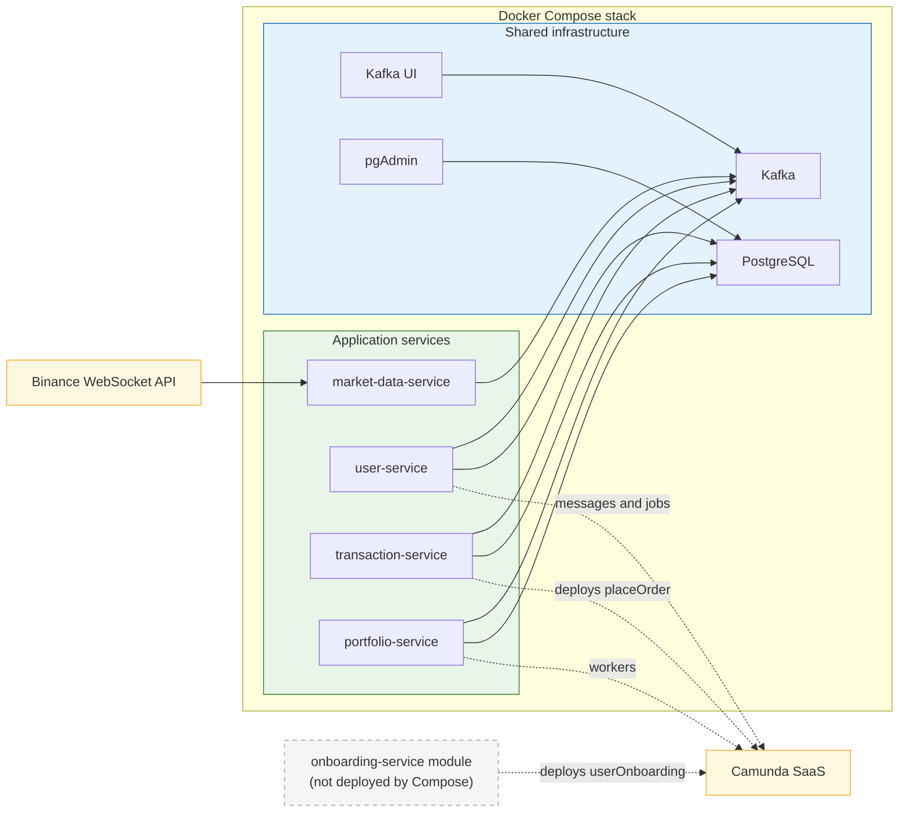

# Deployment Diagram

Notes:

- `docker/docker-compose.yml` runs four application services: `market-data-service`, `portfolio-service`, `transaction-service`, and `user-service`.
- `onboarding-service` exists as a module, but it is not deployed by `docker/docker-compose.yml`.
- The diagram intentionally omits port numbers, container images, and other low-value deployment detail.
