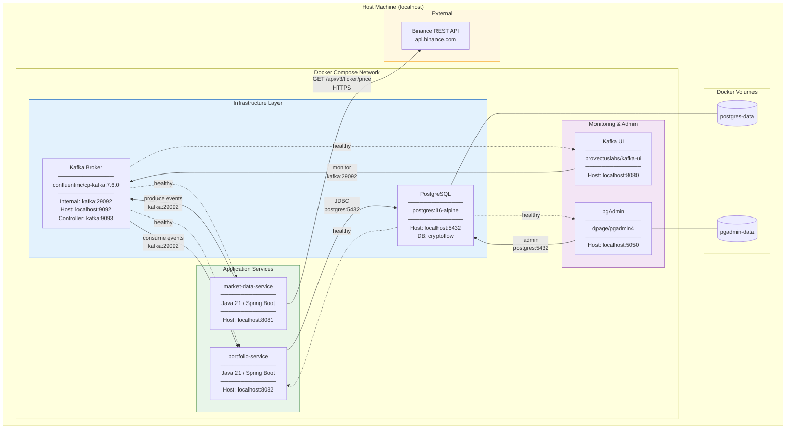
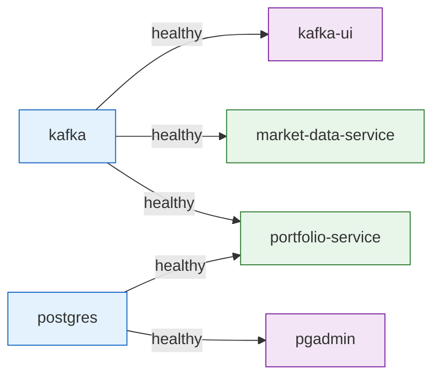

# Deployment Diagram – Docker Compose Stack

## Container Topology

## Startup Order

## Port Map

| Service | Internal Port | Host Port | URL |
|---------|--------------|-----------|-----|
| Kafka (client) | 29092 | 9092 | `localhost:9092` |
| Kafka (controller) | 9093 | — | internal only |
| Kafka UI | 8080 | 8080 | http://localhost:8080 |
| PostgreSQL | 5432 | 5432 | `localhost:5432` |
| pgAdmin | 80 | 5050 | http://localhost:5050 |
| market-data-service | 8081 | 8081 | http://localhost:8081 |
| portfolio-service | 8082 | 8082 | http://localhost:8082 |
