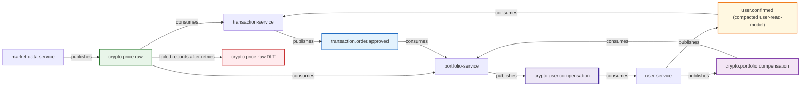
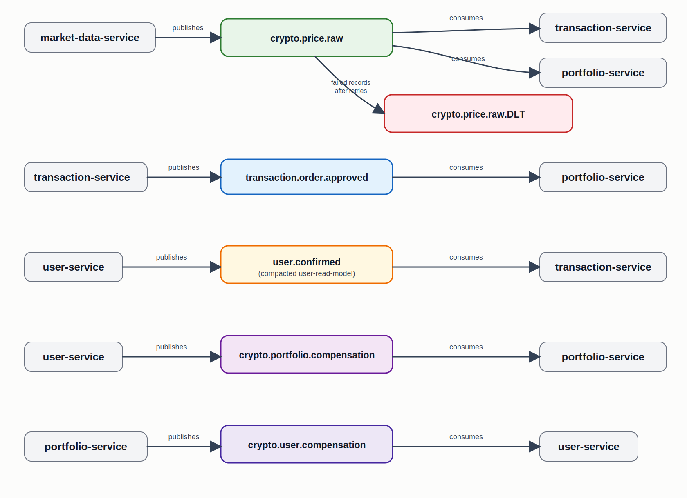

# Kafka Topic Topology

## Overview

## Rendered Preview

## Topic Summary

| Topic | Producer | Consumer | Notes |
|-------|----------|----------|-------|
| `crypto.price.raw` | `market-data-service` | `portfolio-service`, `transaction-service` | Shared live price stream |
| `transaction.order.approved` | `transaction-service` | `portfolio-service` | Approved order events |
| `user.confirmed` | `user-service` | `transaction-service` | Compacted user-read-model topic |
| `crypto.portfolio.compensation` | `user-service` | `portfolio-service` | Compensation flow |
| `crypto.user.compensation` | `portfolio-service` | `user-service` | Compensation flow |
| `crypto.price.raw.DLT` | Consumer error handler | Operational review | Dead-letter topic for failed `crypto.price.raw` records after retries |
