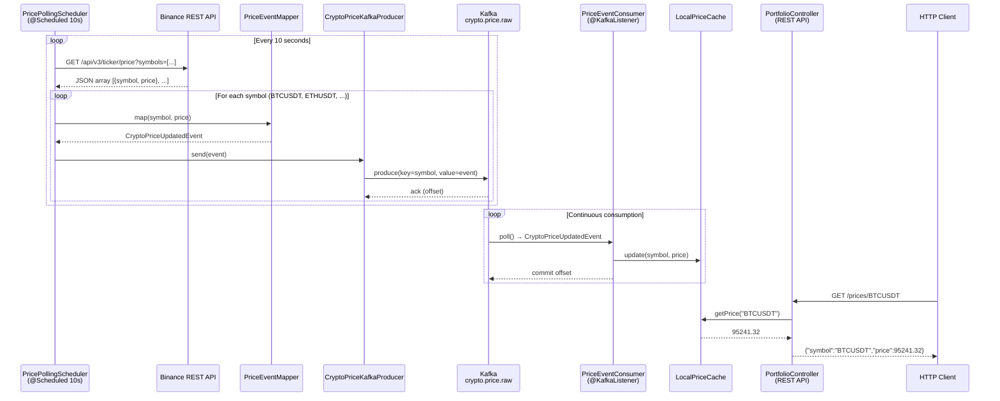
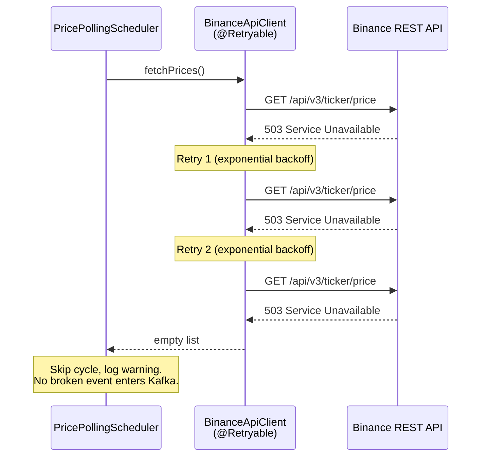
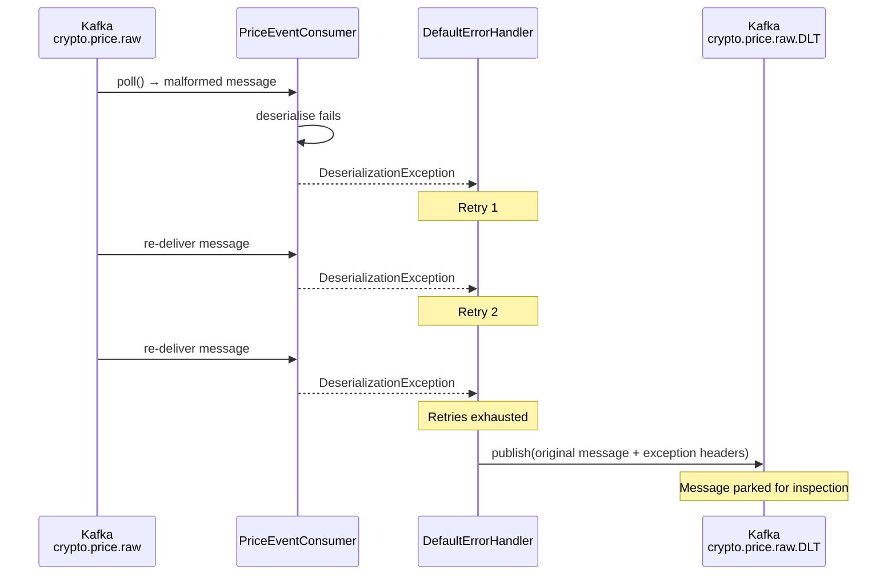

# Sequence Diagram – Event Flow

## Happy Path: Price Polling → Portfolio Update

```mermaid
sequenceDiagram
    participant Scheduler as PricePollingScheduler<br/>(@Scheduled 10s)
    participant Binance as Binance REST API
    participant Mapper as PriceEventMapper
    participant Producer as CryptoPriceKafkaProducer
    participant Kafka as Kafka<br/>crypto.price.raw
    participant Consumer as PriceEventConsumer<br/>(@KafkaListener)
    participant Cache as LocalPriceCache
    participant REST as PortfolioController<br/>(REST API)
    participant Client as HTTP Client

    loop Every 10 seconds
        Scheduler->>Binance: GET /api/v3/ticker/price?symbols=[...]
        Binance-->>Scheduler: JSON array [{symbol, price}, ...]

        loop For each symbol (BTCUSDT, ETHUSDT, ...)
            Scheduler->>Mapper: map(symbol, price)
            Mapper-->>Scheduler: CryptoPriceUpdatedEvent
            Scheduler->>Producer: send(event)
            Producer->>Kafka: produce(key=symbol, value=event)
            Kafka-->>Producer: ack (offset)
        end
    end

    loop Continuous consumption
        Kafka->>Consumer: poll() → CryptoPriceUpdatedEvent
        Consumer->>Cache: update(symbol, price)
        Consumer-->>Kafka: commit offset
    end

    Client->>REST: GET /prices/BTCUSDT
    REST->>Cache: getPrice("BTCUSDT")
    Cache-->>REST: 95241.32
    REST-->>Client: {"symbol":"BTCUSDT","price":95241.32}
```

## Error Path: Binance API Failure with Retry

```mermaid
sequenceDiagram
    participant Scheduler as PricePollingScheduler
    participant Client as BinanceApiClient<br/>(@Retryable)
    participant Binance as Binance REST API

    Scheduler->>Client: fetchPrices()
    Client->>Binance: GET /api/v3/ticker/price
    Binance-->>Client: 503 Service Unavailable

    Note over Client: Retry 1 (exponential backoff)
    Client->>Binance: GET /api/v3/ticker/price
    Binance-->>Client: 503 Service Unavailable

    Note over Client: Retry 2 (exponential backoff)
    Client->>Binance: GET /api/v3/ticker/price
    Binance-->>Client: 503 Service Unavailable

    Client-->>Scheduler: empty list
    Note over Scheduler: Skip cycle, log warning.<br/>No broken event enters Kafka.
```

## Error Path: Poison Pill → Dead Letter Topic

```mermaid
sequenceDiagram
    participant Kafka as Kafka<br/>crypto.price.raw
    participant Consumer as PriceEventConsumer
    participant ErrHandler as DefaultErrorHandler
    participant DLT as Kafka<br/>crypto.price.raw.DLT

    Kafka->>Consumer: poll() → malformed message
    Consumer->>Consumer: deserialise fails
    Consumer-->>ErrHandler: DeserializationException

    Note over ErrHandler: Retry 1
    Kafka->>Consumer: re-deliver message
    Consumer-->>ErrHandler: DeserializationException

    Note over ErrHandler: Retry 2
    Kafka->>Consumer: re-deliver message
    Consumer-->>ErrHandler: DeserializationException

    Note over ErrHandler: Retries exhausted
    ErrHandler->>DLT: publish(original message + exception headers)
    Note over DLT: Message parked for inspection
```
