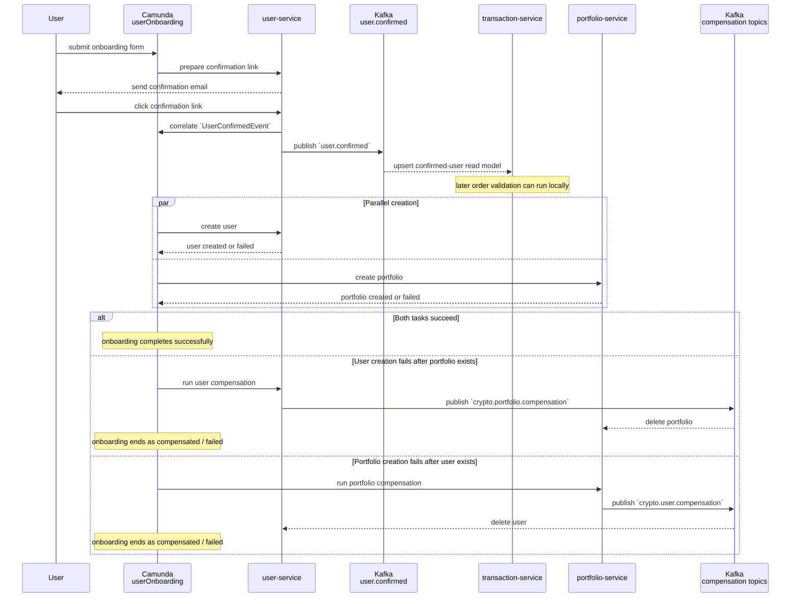
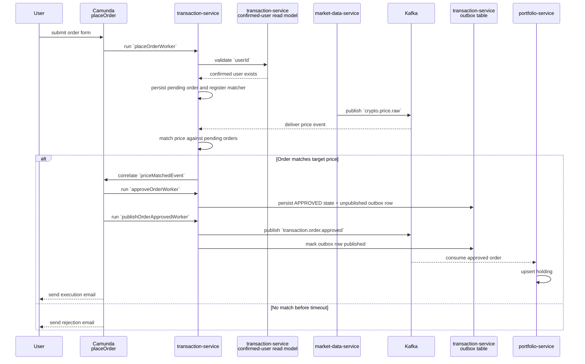
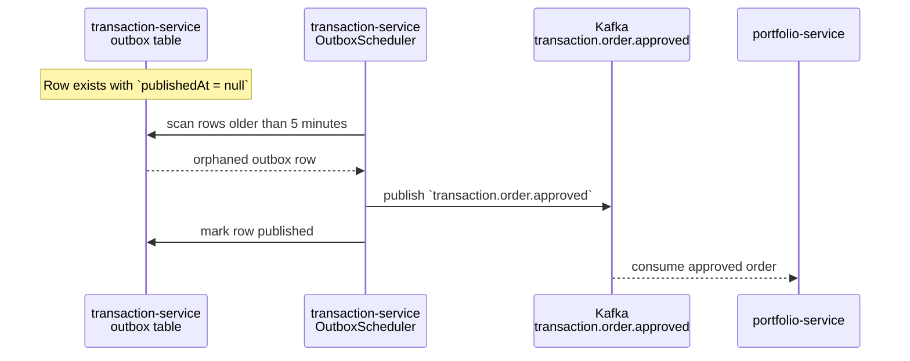
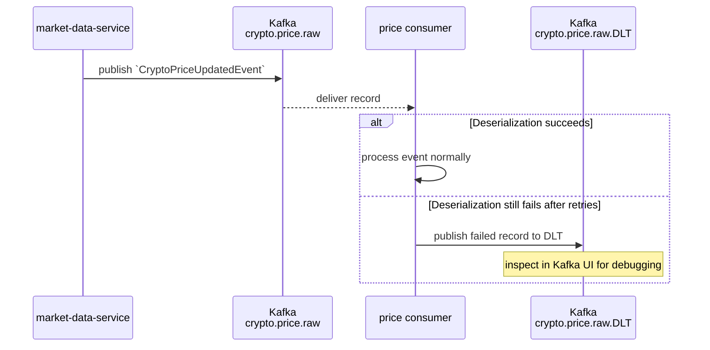
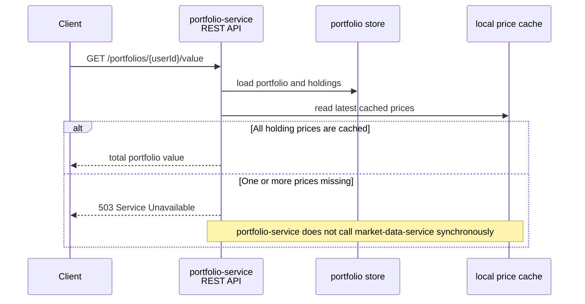

# Sequence Diagram - Event Flow

These diagrams separate Kafka topic traffic from Camunda message correlation. Kafka UI shows the
Kafka arrows; Camunda Operate shows the workflow message arrows.

## 1. Onboarding: Confirmation, Read Model, Compensation

## 2. Trading: Price Match, Outbox, Portfolio Update

## 3. Operational Side Paths

### 3.1 Outbox Recovery

### 3.2 Price Event Dead-Letter Flow

## 4. Portfolio Read Path: Valuation from Local Price Cache

