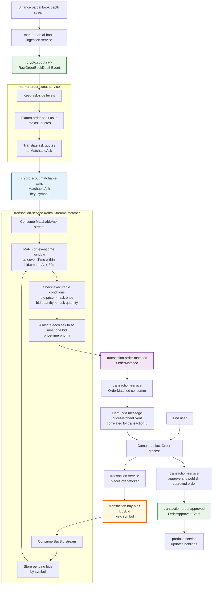

# Transaction Matching Event Flow

This single diagram shows how market data and user orders become a transaction execution decision. It focuses on the event path relevant to matching and intentionally omits scout-only diagnostic topics, retries, dashboards, and persistence details outside the matching decision.

Read from top to bottom: Scout turns Binance order-book asks into executable `MatchableAsk` events, while the order workflow turns user orders into `BuyBid` events. The transaction matcher consumes both streams by symbol, keeps pending bids, evaluates arriving asks against the 30-second event-time window and price/quantity rules, then emits `OrderMatched` when execution is possible.
