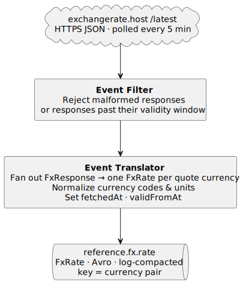

# 01. FX Rate Ingestion

**Type:** stateless &nbsp;|&nbsp; **Required pattern:** Single-Event Processing &nbsp;|&nbsp; **Owner:** TBD &nbsp;|&nbsp; **Status:** draft

## Purpose

Poll a public FX API on a timer, filter and translate the response, and publish rates to a log-compacted Kafka topic that scope 3 materializes as a KTable.

## Why this matters

Slow-moving reference data must be cached in Kafka rather than called per event. The compacted topic *is* the cache — it survives restarts, is replayable, and removes the HTTP API from the event path.

## Patterns hit (catalog references)

| File | Role |
|---|---|
| `10-single-event-processing.md` | per-fetch map/filter, no aggregation |
| `25-event-filter.md` | drop malformed / stale rates before publishing |
| `26-event-translator.md` | normalize currency codes and units into canonical form |
| `06-state-and-stream-table-duality.md` | compacted topic materialized as KTable downstream |
| `20-data-contract.md` | `FxRate` Avro schema as the contract with scope 3 |
| `21-event-serializer-deserializer.md` | Avro + schema registry |

## Topology



<!-- Source: diagrams/01-fx-rate-ingestion.puml — regenerate with `plantuml -tsvg diagrams/01-fx-rate-ingestion.puml` -->

### Control flow

1. **Source** — HTTPS poll against `exchangerate.host/latest` on a 5-minute timer (adjustable). One response per poll carries all tracked currency rates relative to a single base.
2. **Event Filter** — reject responses that are malformed (missing fields, unparseable rates) or older than the configured validity window.
3. **Event Translator** — fan out the accepted response into one `FxRate` event per quote currency. Currency codes normalized to canonical ISO-4217 form, rate units converted if needed, and `fetchedAt` (now) plus `validFromAt` (response timestamp) stamped onto each event.
4. **Sink** — publish each `FxRate` to the log-compacted `reference.fx.rate` topic, keyed by the currency pair (e.g. `USDCHF`). Compaction collapses repeat rates for the same pair into the latest value, so the topic always holds the current view of all pairs.

## Inputs

| Source | Type | Notes |
|---|---|---|
| `exchangerate.host/latest` | HTTPS JSON | free, no API key |

Fallback candidates: ECB reference rates (XML, daily), Fixer.io (paid).

## Outputs

| Topic | Cleanup | Key | Value | Partitions |
|---|---|---|---|---|
| `reference.fx.rate` | compact | `"USDCHF"` string | `FxRate` (Avro) | 1 |

### Avro — `ch.unisg.cryptoflow.shared.events.fx.FxRate`

```
base:        string                   // "USD"
quote:       string                   // "CHF"
rate:        double                   // quote per 1 base
source:      string                   // "exchangerate.host"
fetchedAt:   timestamp-millis
validFromAt: timestamp-millis
```

## State stores

None. The compacted topic is the state — scope 3 owns the KTable materialization.

## Joins / Windowing

N/A.

## Processing guarantees

- At-least-once publish.
- Idempotent by key: log compaction collapses repeat rates into the latest value per pair.

## Interactive queries

N/A at this scope. Optional passthrough on scope 3.

## Open decisions

- [ ] Host FX fetcher as its own service, or extend market-data-service?
- [ ] exchangerate.host vs ECB vs Fixer.io (accuracy vs rate limits vs cost).
- [ ] Poll interval — 1 min (fresher) vs 5 min (stays in free tier).
- [ ] Which currency pairs (USD anchor → CHF, EUR, GBP, JPY, …).
- [ ] Tombstone on invalid response, or skip silently?
- [ ] Registry-aware (`KafkaAvroSerializer` + `schema.registry.url`) vs registryless (`mitchseymour/kafka-streams-avro-serdes`). Both are demonstrated in `lab12Part1`. Recommend registry-aware — but requires adding `schema-registry` to `docker-compose`.

## ADR candidates

- ADR — FX data-source selection.
- ADR — FX topic schema and key shape (string pair vs compound record).

## Related scopes

- Consumer: `03-fx-price-enrichment.md`.
