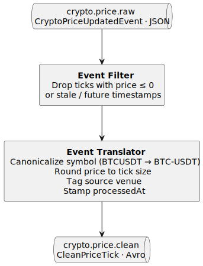

# 02. Price Stream Sanity (Filter + Translator)

**Type:** stateless &nbsp;|&nbsp; **Required pattern:** Single-Event Processing &nbsp;|&nbsp; **Owner:** TBD &nbsp;|&nbsp; **Status:** draft

## Purpose

Consume `crypto.price.raw` and produce `crypto.price.clean`: a sanity-filtered, canonicalized stream that downstream scopes (3, 5, 6) can use without worrying about invalid values, stale ticks, odd symbol notations, or venue-specific encodings.

## Why this matters

Keeps downstream stateful/windowed apps simple by guaranteeing clean input. Also produces *several* stateless operations in one small topology, which satisfies the Week-8 "several stateless operations" requirement.

## Patterns hit

| File | Role |
|---|---|
| `10-single-event-processing.md` | pure per-event chain |
| `25-event-filter.md` | drop invalid / stale / dust ticks |
| `26-event-translator.md` | symbol aliasing, tick-size rounding, envelope wrap |

## Topology



<!-- Source: diagrams/02-price-stream-sanity.puml — regenerate with `plantuml -tsvg diagrams/02-price-stream-sanity.puml` -->

### Control flow

1. **Source** — consume `crypto.price.raw`, the `CryptoPriceUpdatedEvent` stream produced by `market-data-service`. Keyed by trading symbol (`String`).
2. **Event Filter** — drop any tick whose `price` is non-positive, whose `timestamp` is in the future, or whose `timestamp` is older than the staleness threshold N. Produces the `validTicks` intermediate stream.
3. **Event Translator** — transform each valid tick into a new `CleanPriceTick`: symbol canonicalized to `BASE-QUOTE` form, price rounded to the instrument's tick size, source venue tagged (`"binance"`), and a fresh `processedAt` timestamp added. The key (symbol, in canonical form) is preserved. Produces the `cleanTicks` stream.
4. **Sink** — publish each `CleanPriceTick` to `crypto.price.clean` as Avro, keyed by the canonical symbol, preserving per-symbol partitioning and ordering.

## Inputs

| Topic | Source | Key | Value | Serialization |
|---|---|---|---|---|
| `crypto.price.raw` | market-data-service | symbol (`String`) | existing `CryptoPriceUpdatedEvent(eventId, symbol, price, timestamp)` | JSON (Jackson) — today |

The producer currently emits JSON via `JsonSerializer`. See README → "Open cross-cutting decision — serialization" for the JSON→Avro migration question. Input serde used in the topology below (`JsonSerde<CryptoPriceUpdatedEvent>`) reflects option **B** from that decision (JSON-in / Avro-out).

## Outputs

| Topic | Cleanup | Key | Value | Partitions |
|---|---|---|---|---|
| `crypto.price.clean` | delete (default retention) | symbol | `CleanPriceTick` (Avro) | match input |

### Avro — `ch.unisg.cryptoflow.shared.events.marketdata.CleanPriceTick`

```
symbol:          string                 // canonical, e.g. "BTC-USDT"
price:           double                 // rounded to tick size
sourceVenue:     string                 // "binance"
sourceTimestamp: timestamp-millis
processedAt:     timestamp-millis
```

> `volume` intentionally omitted — the existing `CryptoPriceUpdatedEvent` does not carry it. Adding it would require extending the producer first; listed in Open Decisions.

## State stores

None.

## Joins / Windowing

N/A.

## Processing guarantees

- At-least-once.
- No side effects → retries are safe. Output key identical to input key, so partitioning preserved.

## Interactive queries

N/A.

## Open decisions

- [ ] Stale threshold N — 5s / 10s / 30s?
- [ ] Input serde — keep JSON (matches existing producer) or coordinate a JSON→Avro migration on `crypto.price.raw` first? See README cross-cutting decision; current sketch assumes option **B** (JSON-in / Avro-out).
- [ ] Run inside market-data-service or as a new stream app?
- [ ] Do downstream scopes consume `.raw` or `.clean` as default? (Propose `.clean`.)
- [ ] Include `volume` — requires extending the producer's `CryptoPriceUpdatedEvent` first. Defer unless a downstream scope needs it (#5 OHLC could use it; #6 indicators don't strictly need it).
- [ ] Wrap output in a CloudEvents envelope (pattern 22) for observability?

## ADR candidates

- ADR — canonical price event schema (which fields, which units, which venue tag).

## Related scopes

- Input to: `03-fx-price-enrichment.md`, `04-portfolio-valuation.md` (price side), `05-ohlc-candles.md`, `06-technical-indicators.md`.
