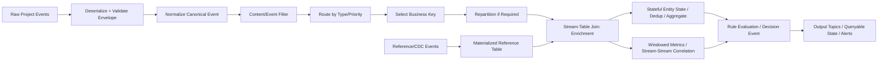

# Stream Processing Topology Theory Pack for Codex

Use this document as a compact theory/context handoff before asking Codex to design or implement the project-specific topology. The goal is not to create isolated stream functions, but one coherent processing graph where each stage has a reason, receives a clearly defined input, and produces an output needed by later stages.

---

## 1. Core Definitions

### Event
An event is an observable occurrence at a particular point in time. In software systems, an event should represent something that already happened, for example `OrderPlaced`, `PaymentReceived`, `SensorReadingCaptured`, or `UserClickedSearchResult`.

### Event / Data Stream
A data stream is an unbounded sequence of events. Consequences:

- The stream may have started before the application began observing it.
- The stream may continue indefinitely.
- Processing must be continuous, not finite like batch jobs.
- Aggregations cannot wait for “all data”; they need state, windows, or both.

Important stream characteristics:

- **Ordered:** there is a notion of before/after, at least per key or partition.
- **Immutable:** events are not modified after they occur.
- **Replayable:** historical events can be read again for recovery, reprocessing, or recomputation.

### Event Schema
Events from the same source should share a stable schema. A schema defines the event attributes, types, and semantics. Typical fields:

- event identifier
- timestamp
- event type
- business key / aggregate key
- payload attributes
- metadata such as source system, schema version, correlation ID, causation ID

### Event Envelope
An event envelope is a common wrapper around different event payloads. It standardizes cross-cutting metadata such as ID, schema, key, timestamp, source, and type. The envelope should be independent of the payload format.

Recommended conceptual shape:

```text
EventEnvelope<TPayload>
  eventId
  eventType
  eventTime
  source
  key
  schemaVersion
  correlationId
  causationId
  payload: TPayload
```

### Data Contract
A data contract/schema lets independent Event Processing Applications understand each other’s events without tight coupling between sender and receiver. Prefer schema-based formats such as Avro/Protobuf/JSON Schema and use a schema registry where available.

### Serialization / Deserialization
- **Serializer:** converts an event object into a binary representation for the event streaming platform.
- **Deserializer:** reconstructs the event object from bytes, using the event data and schema.

---

## 2. Stream Processing vs Other Processing Styles

### Request-response
- Client sends request; system responds.
- Blocking interaction.
- Low latency, but not designed for continuous event streams.

### Batch processing
- Scheduled processing.
- High throughput.
- Results are available later.

### Stream processing
- Continuous processing.
- Non-blocking interaction.
- Reacts to events as they arrive.
- Queries/topologies run continuously and produce results when events arrive.

Database-style thinking stores data first and runs queries on demand. Stream-processing thinking keeps the processing logic running and pushes events through it continuously.

---

## 3. Event Processing System and Topology

An event processing system consists of:

```text
Event Producers / Sources
  -> Event Channels / Topics
  -> Event Processors
  -> Event Channels / Topics
  -> Event Consumers / Sinks
```

A **topology** is the processing graph of the stream application. It contains:

- source streams / source processors
- stream processors as nodes
- sink streams / sink processors
- directed event flow from input to output

A topology should be designed as a meaningful pipeline, not as unrelated functions. Each processor should perform one clear responsibility and pass a well-defined event/table/result to the next processor.

---

## 4. Stateless, Stateful, and Windowed Processing

### Stateless event processing
Each event is processed independently. The processor does not need previous events.

Typical operations:

- filter
- route
- transform/map
- project/content filter
- split/flatMap
- merge streams

Properties:

- Easy to scale.
- Easy to recover from failures.
- No local state store needed.
- Can often be implemented with a simple producer/consumer or Kafka Streams `map`, `filter`, `branch/split`, `flatMap`, `merge`.

### Stateful event processing
Processing depends on more than one event and therefore requires state.

Typical operations:

- count events by key
- aggregate totals
- deduplicate by event ID
- maintain latest status per business entity
- join streams/tables
- moving averages

Important rules:

- Events with the same key must be routed to the same partition for correct local state.
- Each processor instance maintains local state for the partitions it owns.
- State introduces challenges: memory usage, persistence, recovery, and rebalancing.
- Persist state or use framework-managed state stores/changelog topics; do not rely only on in-memory variables.

### Windowed processing
Windowed processing is stateful processing scoped to time. It is needed when unbounded streams must be grouped into finite time slices.

Typical operations:

- moving averages
- time-bucketed counts
- top-N per time interval
- stream-stream joins
- anomaly detection over recent activity

Window parameters:

- **Window size:** how much event time each window covers.
- **Advance interval:** how often the window moves.
- **Grace period:** how long the window remains updatable for late events.

Window types:

- **Tumbling window:** fixed-duration, non-overlapping, gapless.
- **Hopping window:** fixed-duration, overlapping.
- **Session window:** dynamically sized, non-overlapping, data-driven; based on periods of inactivity.

---

## 5. Time Semantics

Time is central in stream processing because many operations are windowed and distributed systems do not share a perfect global “now”.

Use the correct time concept:

- **Event time:** when the real-world/business event occurred. Usually the most relevant for domain correctness.
- **Log append / ingestion time:** when the event arrived at Kafka/the streaming platform. Use when event time is missing or unreliable.
- **Processing time:** when the stream processor received the event. This may be much later than event time.

For project topologies, prefer event time for business calculations and windowing. Define timestamp extraction clearly and decide how to handle missing, malformed, or future timestamps.

---

## 6. Stream-Table Duality

A stream is a sequence of changes. A table is the current state derived from those changes.

```text
Stream: change events over time
Table: latest state after applying those changes
Materialization: stream -> table/current view
```

Use this concept to model current project state:

- A stream of `CustomerUpdated` events can materialize into a customer table.
- A stream of `OrderStatusChanged` events can materialize into the latest order status table.
- A stream of CDC events from a database can materialize into a reference table for enrichment.

This enables stream-table joins: live events are enriched using the latest state from a materialized table.

---

## 7. Processing Guarantees and Idempotency

Processing guarantees:

- **At-most-once:** an event may be lost, but not processed twice.
- **At-least-once:** an event is not lost, but may be processed more than once.
- **Exactly-once:** each input event affects output/state exactly once within the stream-processing system.

Exactly-once is important for accurate aggregations and joins, but side effects outside Kafka/Streams may still happen more than once. Therefore:

- Make writers idempotent where possible.
- Make readers/processors safe against duplicate events.
- Use stable event IDs for deduplication.
- For Kafka Streams, use exactly-once processing configuration where the project requires accurate stateful/windowed results.
- Use `read_committed` semantics for consumers that must not see aborted transactional writes.

---

## 8. Design Patterns to Use in the Topology

### 8.1 Single-event processing / map-filter pattern
Processes each event in isolation. Use for validation, filtering, routing, projection, and conversion.

#### Content Filter
One input stream, one output stream. Keeps all events but reduces each event to a subset of attributes. Attribute values stay unchanged.

Use when later processors need only part of a large event.

#### Event Filter
One input stream, one output stream. Drops events that do not satisfy a predicate. Does not transform, duplicate, or modify events.

Use for invalid events, irrelevant event types, or threshold-based routing.

#### Event Translation
One input stream, one output stream. Modifies attribute values and may change event structure. Does not add or remove events.

Use for schema normalization, unit conversion, renaming fields, or converting raw source events into canonical project events.

#### Event Router
One input stream, multiple output streams. Routes events based on conditions. Does not modify or duplicate events.

Use for separating event categories, priorities, tenants, or downstream workflows.

#### Event Splitter
One input stream, one output stream. Splits one parent event into zero or more child events. May change keys.

Use for batch-like payloads, arrays, nested collections, or composite events.

#### Event Stream Merger
Multiple input streams, one output stream. Forwards events unchanged. No ordering guarantee across input streams. Streams should have compatible key and value types.

Use to unify equivalent event streams after normalization.

---

### 8.2 Processing with local state
Aggregations require state. Events with the same key must go to the same partition so the same task owns the required local state.

Use for:

- counts by entity
- last-known state by entity
- deduplication state
- rolling aggregates
- local lookup caches

---

### 8.3 Multiphase processing / repartitioning
Use when the first aggregation key is not the final aggregation key.

Conceptual flow:

```text
input events
  -> local aggregate by key A
  -> repartition by key B
  -> second aggregate by key B
  -> output result
```

Use this when local aggregation reduces volume before global/top-level aggregation, or when the project requires different grouping dimensions at different stages.

---

### 8.4 Stream-table join / external lookup replacement
Avoid per-event synchronous database lookups inside stream processors. They add latency, load, and availability coupling.

Better topology:

```text
Reference DB changes / CDC topic
  -> materialized KTable / local state cache
Business event stream
  -> stream-table join with local table
  -> enriched event stream
```

Use for enrichment with customer profiles, product data, configuration, account state, permissions, rules, or other reference data.

---

### 8.5 Table-table join
Join two materialized tables. This is non-windowed and uses the latest state from both tables.

Use for joining current state, for example:

```text
current_order_state table
  JOIN current_customer_state table
  -> current_order_customer_view
```

Supported conceptual variants:

- equi-join: same key on both sides
- foreign-key join: lookup using a field that differs from the primary key

---

### 8.6 Stream-stream join / windowed join
When joining two real event streams, do not join against all history. Match events with the same key that occur within the same time window.

Use for correlation, for example:

```text
SearchPerformed stream
  JOIN ClickedResult stream
  WITHIN 5 seconds
  -> SearchClickCorrelation event
```

A stream-stream join is inherently windowed.

---

### 8.7 Out-of-sequence / late events
Events may arrive late or out of order. Processing should handle reordering.

Use a grace period to allow late arrivals to update windows. Decide explicitly:

- how much lateness is tolerated
- whether late updates emit corrections
- what happens to events later than the grace period
- whether to route too-late events to a dead-letter/late-event topic

---

### 8.8 Reprocessing
Replay existing event streams when logic changes or bugs are fixed.

Options:

- Run a new version of the application in parallel and write to new output topics.
- Reset offsets and recompute derived state/output.

Design implication: keep raw/source topics replayable and avoid destructive transformations as the only copy of data.

---

### 8.9 Interactive queries
Read results directly from application state stores instead of consuming output topics when low-latency lookup of current state is needed.

Use for status APIs, dashboards, or operational views over materialized state.

---

### 8.10 Large event payloads
Avoid pushing very large payloads through the streaming platform.

Patterns:

- **Claim Check:** store the large payload externally, e.g. object storage, and send only a pointer in the event.
- **Event Chunking:** split a large event into chunks and reassemble client-side.

Prefer claim check when payloads are very large and mostly retrieved by selected consumers. Prefer chunking only when consumers truly need the full payload and reassembly complexity is acceptable.

---

## 9. Coherent Project Topology Template

Codex should adapt this skeleton to the actual project names, schemas, topics, and business domain. The important point is that stateless, stateful, and windowed processing are not separate demos; they are stages of one domain pipeline.

```text
Raw input topics
  -> deserialize + validate envelope/schema                    [stateless]
  -> normalize to canonical project event                      [stateless]
  -> content filter / project relevant fields                  [stateless]
  -> event filter: drop/route invalid or irrelevant events     [stateless]
  -> event router: split by domain event type or priority      [stateless]
  -> choose/rewrite business key                               [stateless, may trigger repartition]
  -> repartition by business key if required                   [partitioning boundary]
  -> materialize reference/update topics as tables             [stateful table]
  -> stream-table join for enrichment                          [stateful]
  -> deduplicate by eventId / maintain latest entity state     [stateful]
  -> aggregate by entity or domain key                         [stateful]
  -> windowed aggregation or stream-stream correlation         [windowed + stateful]
  -> apply project rules / derive decision events              [stateless or stateful]
  -> sink result topics, dashboards, APIs, alerts, stores      [sink]
```

### Example conceptual node list

Replace names with actual project entities:

| Stage | Processor | Type | Purpose |
|---|---|---:|---|
| 1 | `DeserializeAndValidateEnvelope` | Stateless | Read raw events, deserialize, enforce schema/envelope. |
| 2 | `NormalizeToCanonicalEvent` | Stateless | Convert source-specific shape into project canonical event. |
| 3 | `ContentFilterRelevantFields` | Stateless | Remove attributes not needed downstream. |
| 4 | `EventFilterValidBusinessEvents` | Stateless | Keep only events relevant and valid for the topology. |
| 5 | `RouteByEventTypeOrPriority` | Stateless | Split stream into meaningful branches. |
| 6 | `SelectBusinessKey` | Stateless / repartition boundary | Ensure all events for same entity go to same partition. |
| 7 | `MaterializeReferenceTable` | Stateful table | Build latest reference/domain state from CDC/update events. |
| 8 | `EnrichWithReferenceTable` | Stateful stream-table join | Add current contextual data to each event. |
| 9 | `MaintainEntityState` | Stateful | Keep latest status, deduplication state, counters, or aggregates. |
| 10 | `WindowedMetricsOrCorrelation` | Windowed stateful | Compute metrics or correlate related events within time windows. |
| 11 | `DetectConditionAndEmitResult` | Stateless/stateful | Turn enriched/windowed state into domain result events. |
| 12 | `WriteSinks` | Sink | Write final topics/API-readable state/alerts. |

### Example Mermaid diagram



---

## 10. What Codex Should Inspect in the Existing Project

Before coding or proposing final topology names, Codex should inspect:

- Existing event classes/DTOs/schemas.
- Kafka topic names and configuration.
- Producer/consumer configuration.
- Current key selection and partitioning strategy.
- Existing timestamps and whether they represent event time or processing time.
- Existing schema registry, serializers, and deserializers.
- Existing services/databases that should be represented as tables/CDC streams instead of synchronous lookups.
- Current failure handling, retries, duplicate handling, and offset management.
- Current tests and whether a topology test driver or integration test setup exists.

---

## 11. Decisions Codex Must Make Explicitly

For the final project-specific topology, require Codex to state:

1. **Sources:** input topics and event schemas.
2. **Sinks:** output topics, tables, APIs, alerts, or dashboards.
3. **Business key:** the key used for partitioning and state correctness.
4. **Stateless processors:** filter, map, route, split, merge stages.
5. **Stateful processors:** state stores, tables, joins, deduplication, aggregates.
6. **Windowed processors:** window type, size, advance interval, and grace period.
7. **Time semantics:** event time vs ingestion time vs processing time.
8. **Late-event policy:** update, ignore, correct, or route to late-event topic.
9. **Processing guarantee:** at-most-once, at-least-once, or exactly-once.
10. **Reprocessing strategy:** reset offsets or run parallel version with new output topics.
11. **Interactive query needs:** whether state should be exposed for low-latency lookups.
12. **Schema/data contract:** envelope fields, schema versioning, and compatibility.

---

## 12. Anti-Patterns to Avoid

- Designing stateless, stateful, and windowed processors as unrelated examples.
- Using processing time for business windows when event time exists.
- Doing per-event synchronous database lookups for enrichment.
- Aggregating without ensuring all same-key events are co-partitioned.
- Keeping state only in local variables without durable recovery.
- Ignoring late or out-of-order events in windowed operations.
- Claiming exactly-once for external side effects without idempotency.
- Losing replayability by deleting raw events too early.
- Using very large Kafka messages when claim check or chunking is more appropriate.

---

## 13. Minimal Prompt to Give Codex After This File

```text
Using the theory in this markdown file, inspect this project and propose one coherent stream-processing topology. It must include stateless, stateful, and windowed processing as connected stages of the same domain flow, not as separate examples.

First identify existing topics, event schemas/classes, keys, timestamps, services, and sinks. Then produce:
1. a Mermaid topology diagram,
2. a table of processors with type: stateless/stateful/windowed,
3. the selected event-time strategy,
4. the state stores/tables and their keys,
5. the window definitions and grace periods,
6. the processing guarantee/idempotency strategy,
7. implementation steps using the project’s existing structure.

Do not invent domain entities if they already exist in the project. Prefer existing names and schemas. If something is missing, propose the smallest addition required.
```

