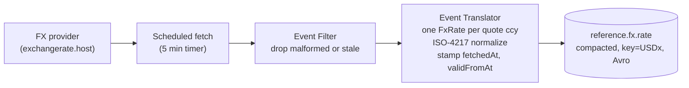
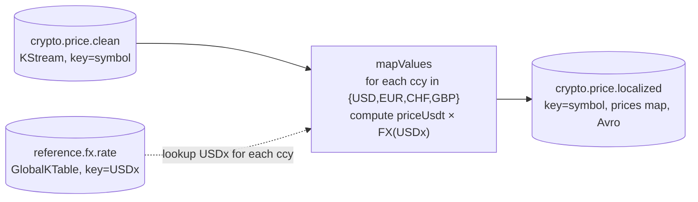
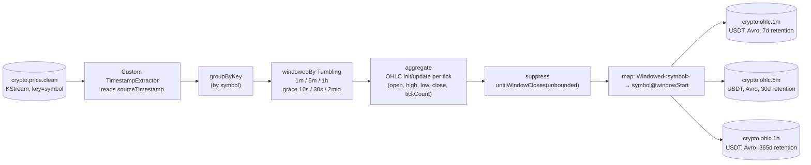
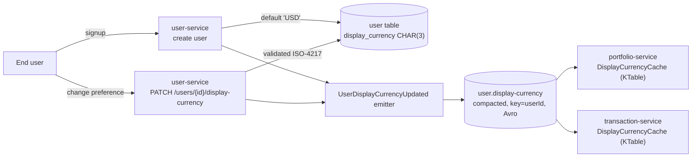
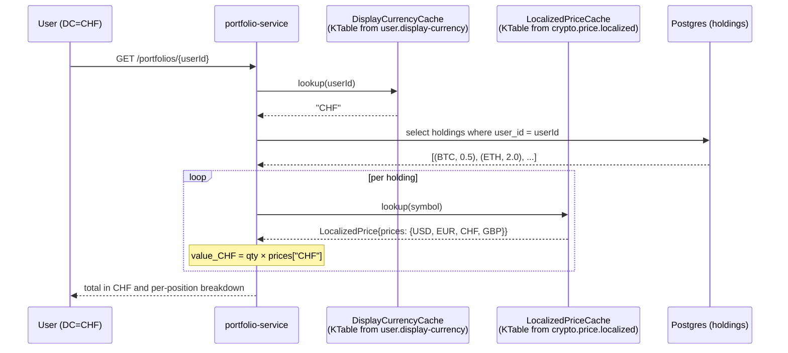
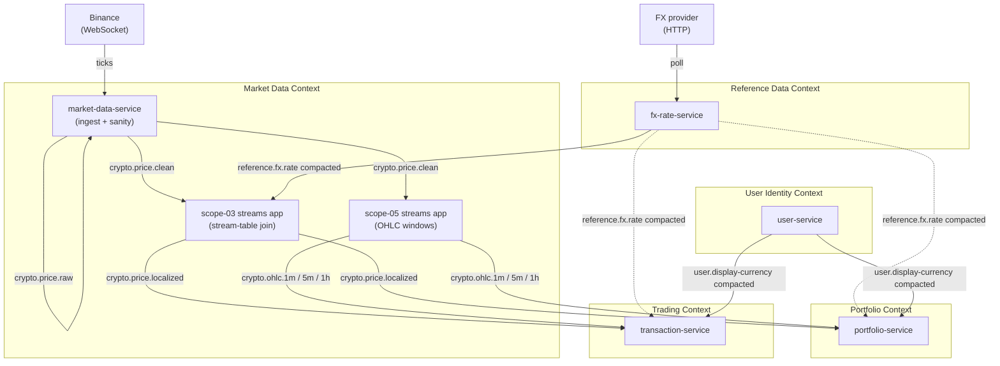

# Topologies for the Display Currency, FX, Portfolio and OHLC scopes

Diagrams supporting [00-display-currency-cross-context.md](../00-display-currency-cross-context.md) and ADRs 0028 through 0032. All Mermaid; renders in VS Code (with the built-in Markdown preview or the Mermaid extension), JetBrains IDEs (with the Mermaid plugin), GitHub, and GitLab.

## 1. fx-rate-service (scope 01): stateless producer pipeline

Polls a public FX provider on a timer, filters invalid responses, fans out into one `FxRate` per quote currency, publishes to the compacted topic. See [ADR-0029](../../adrs/0029_fx_rate_service_as_reference_data_context.md).

## 2. Scope 03 FX price enrichment: stream-table join

Joins `crypto.price.clean` with the FX GlobalKTable, emits a `LocalizedPrice` carrying a map of values per supported currency. See [ADR-0030](../../adrs/0030_stream_table_join_for_price_localization.md).

## 3. Scope 05 OHLC: tumbling-window aggregation with suppress

Aggregates `crypto.price.clean` into closed OHLC bars per symbol per window, USDT-denominated. See [ADR-0031](../../adrs/0031_venue_native_ohlc_with_read_time_conversion.md).

Each interval is its own pipeline instance with its own window size, grace, and state store; the diagram collapses the three siblings for clarity.

## 4. Display Currency propagation (User Identity context)

user-service is the source of truth; both Portfolio and Trading consume the compacted topic as a KTable so the value is available at API read time without an HTTP call. See [ADR-0028](../../adrs/0028_display_currency_as_user_identity_data.md).

## 5. Read-time conversion: portfolio valuation request

Display-only doctrine means conversion happens at the API boundary, not inside the streams app. Portfolio looks up the user's Display Currency in its KTable, looks up each holding's `LocalizedPrice` in its KTable, picks the right slot in the `prices` map, and sums. The buy-time quote flow in transaction-service is structurally identical.

## 6. Cross-context overview: how the new topics connect

Solid arrows are the runtime data flow on the hot path. Dotted arrows show that Portfolio and Trading could hold the FX KTable directly for any read that does not go through `LocalizedPrice` (currently none, but the option is there per ADR-0029).

