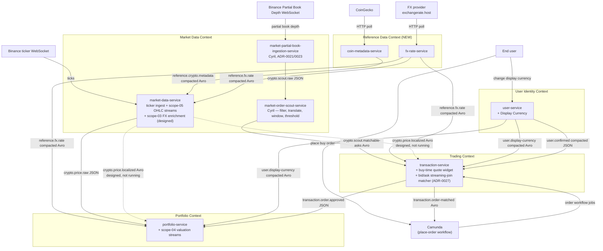
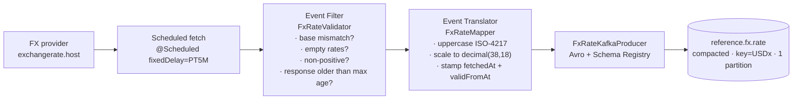
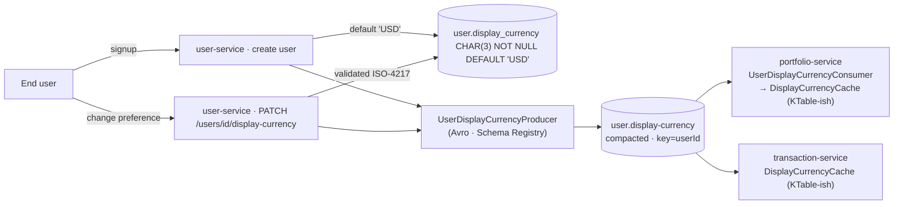
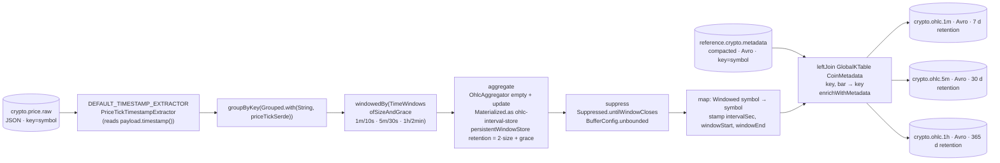
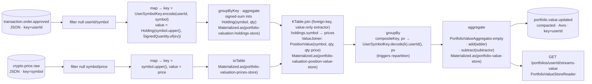
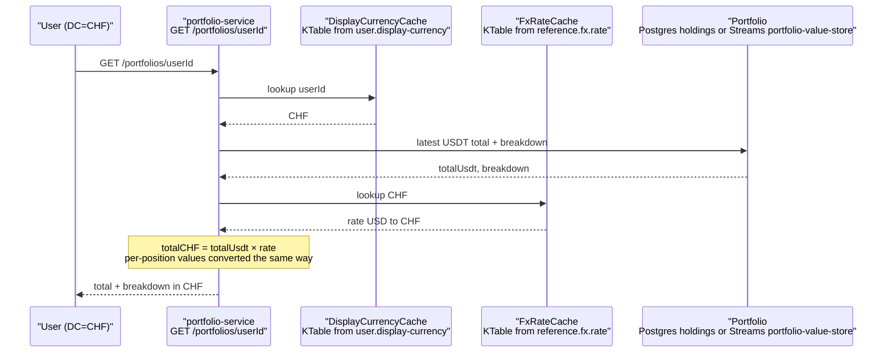
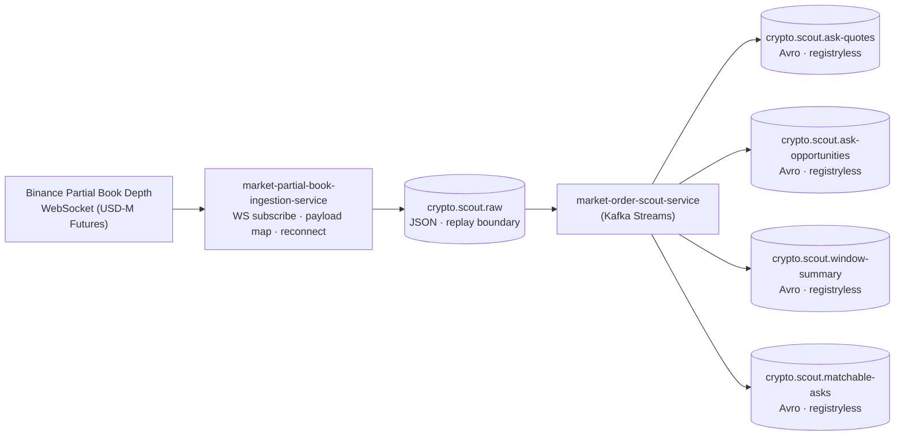
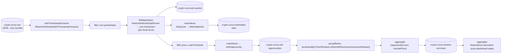
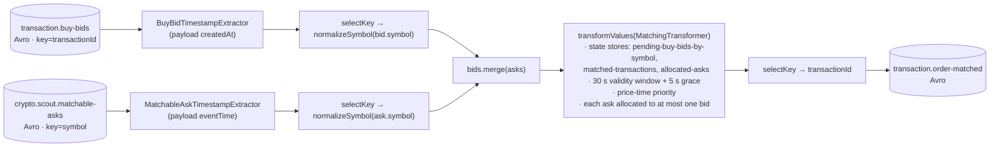
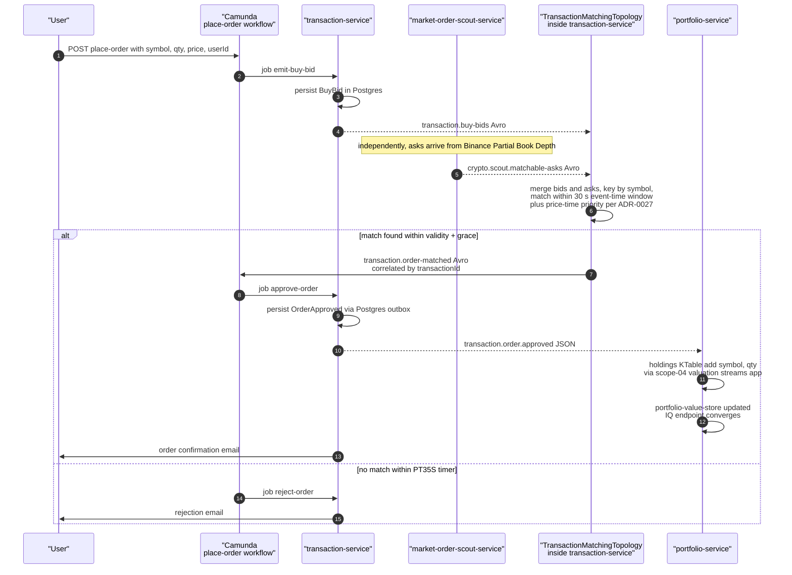

# Event Processing Architecture Summary

**Audience:** report and presentation baseline — distilled WHY behind every architectural choice introduced in PR #36 ("Display Currency + OHLC") and PR #37 ("Portfolio Valuation Streams App").

**Reading order:** §1 sets the headline contributions. §2 maps the bounded contexts touched. §3 walks each event pipeline as a topology with patterns annotated. §4 lists every ADR with its driving question. §5 collects the cross-cutting concerns. §6 calls out the trade-offs we deliberately chose. §7 is the verification harness.

---

## 1. Headline contributions (one slide)

Across three pull requests CryptoFlow ships seven event-processing artefacts that together exercise **every required pattern** in the EDPO catalog. Janni's PR #36 and PR #37 added the FX / Display-Currency / OHLC / Portfolio-Valuation stack; Cyril's PR #34 added the order-book ingestion + market-order-scout topology and the bid/ask matcher inside transaction-service.

| # | Artefact | Type | Host service | Owner / PR | Pattern flagship |
|---|---|---|---|---|---|
| A | `fx-rate-service` | stateless producer pipeline | new service (Reference Data context) | Janni / #36 | Event Filter + Event Translator → compacted topic as cache |
| B | `coin-metadata-service` | stateless producer pipeline | new service (Reference Data context) | Janni / #36 | Compacted reference data fan-in for a GlobalKTable consumer |
| C | `user.display-currency` propagation | compacted ECST topic | extended `user-service` | Janni / #36 | KTable materialisation cross-context, no synchronous HTTP |
| D | Scope-05 OHLC streams app | windowed aggregation + stream-table join | inside `market-data-service` | Janni / #36 | Tumbling windows · custom `TimestampExtractor` · `suppress(untilWindowCloses)` · stream × GlobalKTable enrichment |
| E | Scope-04 portfolio valuation streams app | stateful join + repartition + IQ | inside `portfolio-service` | Janni / #37 | FK Table-Table Join · Multiphase Repartitioning · Local State · Interactive Queries · Reprocessing demo |
| F | `market-partial-book-ingestion-service` + `market-order-scout-service` | stateless ingestion + stateful streams app | two new services (Market Data context) | Cyril / #34 | Content Filter · Event Translator · Event Router · windowed threshold aggregation over the order book |
| G | Bid/ask matching streams app | windowed KStream × KStream join | inside `transaction-service` | Cyril / #34 (+ ADR-0027) | **Streaming Join** with 30 s event-time window + 5 s grace, price-time priority |

PRs #36 and #37 also introduce the **Confluent Schema Registry** (ADR-0032) as the platform's contract layer for new derived events, replacing ad-hoc JSON. PR #34's market-scout derived topics keep the registryless Avro flavour from ADR-0022 (grandfathered).

### Pattern coverage matrix (after PR #36 + #37)

| Required pattern | Where it lives | Status |
|---|---|---|
| Single-Event Processing | `fx-rate-service`, `coin-metadata-service` (poll → filter → translate → publish) | ✅ |
| Processing with Local State | OHLC window stores, portfolio valuation KTables | ✅ |
| Multiphase Repartitioning | `KTable.groupBy((userId,symbol)→userId)` inside the portfolio valuation topology | ✅ |
| Stream-Table Join (external lookup) | OHLC × `reference.crypto.metadata` GlobalKTable; scope-03 `crypto.price.clean` × `reference.fx.rate` GlobalKTable (designed, not yet running) | ✅ |
| Table-Table Join (foreign-key) | `holdings KTable × prices KTable` on `symbol` inside portfolio valuation | ✅ |
| Streaming Join (KStream × KStream) | transaction-service bid/ask matcher: `transaction.buy-bids` × `crypto.scout.matchable-asks` with a 30 s event-time window + 5 s grace (PR #34, Cyril, ADR-0027) | ✅ |
| Content Filter / Event Router | `market-order-scout-service` filters `crypto.scout.raw` to ask-side levels, routes to `ask-quotes` → threshold → `ask-opportunities` → window-summary (PR #34, Cyril) | ✅ |
| Out-of-Sequence Events | tumbling windows with grace (10 s / 30 s / 2 min) in scope-05 OHLC | ✅ |
| Reprocessing | fresh `application.id` rebuilds both portfolio state stores and OHLC bars from offset 0 | ✅ |
| Interactive Queries | `GET /portfolios/{userId}/streams-value` over `portfolio-value-store` | ✅ |
| State-and-Stream-Table Duality | every derived KTable in scope-04, scope-05, plus all compacted reference topics | ✅ |
| Suppressed Event Aggregator | `Suppressed.untilWindowCloses(BufferConfig.unbounded())` after every OHLC interval aggregate | ✅ |
| Custom Timestamp Extractor | `PriceTickTimestampExtractor` drives all three OHLC pipelines off Binance event time | ✅ |

---

## 2. Bounded-context delta

Before this work the platform recognised five contexts (Market Data, User Identity, Onboarding, Trading, Portfolio). The two PRs add a sixth, **Reference Data**, and wire new edges across the existing ones.



Solid arrows are the runtime data flow on the hot path across context boundaries. Dotted arrows are the scope-03 `crypto.price.localized` route — designed and ADR-locked (ADR-0030). In the current slice every consumer reads `reference.fx.rate` directly from fx-rate-service and does the multiplication on read (see §3.6).

Intra-service producer / consumer relationships (e.g. `transaction-service` producing `transaction.buy-bids` from the place-order worker and reading it back inside the bid/ask matcher, or `market-data-service` consuming its own `crypto.ohlc.*` for the dashboard) are deliberately omitted from this context-level view — they live inside one service and don't cross the boundary the diagram is meant to show. They appear in the per-pipeline topology diagrams in §3.

**One-line summary per context.**

- **Market Data Context** — ingests live Binance feeds (ticker WebSocket + Partial Book Depth) and turns them into platform-internal topics; also hosts the OHLC and (designed) FX-enrichment streams modules and the order-book scout pipeline.
- **Reference Data Context** — owns slow-moving, externally-sourced facts (FX rates, coin metadata) and publishes them on compacted Kafka topics that every consumer materialises as a (Global)KTable cache.
- **User Identity Context** — source of truth for users and per-user identity data (confirmation state, Display Currency); propagates changes to other contexts via compacted ECST topics.
- **Onboarding Context** — coordinates the multi-service user-registration saga in a Camunda BPMN, owning the parallel user-creation + portfolio-creation flow (untouched by these PRs).
- **Trading Context** — owns pending orders, the bid/ask matching streams app, and order approval; converts buy-time quotes to the user's Display Currency at API read time.
- **Portfolio Context** — owns holdings and continuous portfolio valuation (scope-04 streams app); converts portfolio totals to the user's Display Currency at API read time and exposes Interactive Queries.

**Why a sixth context.** ADR-0029 carves Reference Data out of Market Data because (a) Market Data is push-driven WebSocket ingestion, (b) Reference Data is pull-driven slow-moving HTTP polling, and (c) the natural growth path (exchange calendars, trading-pair metadata, instrument master) all belong with FX, not with tick processing. Two services live there today (fx-rate-service, coin-metadata-service); both publish to compacted topics that consumers materialise as KTables / GlobalKTables.

**Market Data Context hosts three services**, not one. The ticker flow (`market-data-service` ingests Binance tick prices and hosts the scope-05 OHLC streams module — and would host the scope-03 FX enrichment streams module if/when it ships) and the order-book flow (`market-partial-book-ingestion-service` → `crypto.scout.raw` → `market-order-scout-service` → derived scout topics) are independent ingestion pipelines from Binance with no shared state. ADR-0023 deliberately split ingestion from scout processing so that `crypto.scout.raw` is a proper inter-service contract instead of an in-process replay buffer. The bid/ask matching streams app that consumes `crypto.scout.matchable-asks` lives in `transaction-service` (Trading Context) — that's where pending bids live and where the matching decision belongs.

**A note on "streams apps" as nodes.** None of scope-03, scope-04, or scope-05 are separate services or separate bounded contexts. Each is a Kafka Streams topology declared as one `@Configuration` (`@EnableKafkaStreams`) inside an existing Spring Boot service — scope-04 inside `portfolio-service`, scope-05 inside `market-data-service`, scope-03 (designed) also inside `market-data-service`. They get their own `application.id` so the consumer-group offsets don't overlap with the host service's existing `@KafkaListener` consumers, but the deployment, persistence, and HTTP surface stay with the host. The diagram therefore folds them into the host service's node rather than drawing them as siblings.

---

## 3. Per-pipeline topology deep dive

Every pipeline below follows the same documentation shape: **purpose** → **topology diagram** → **operators and state stores** → **patterns realised** → **trade-offs**.

### 3.1 fx-rate-service — stateless producer pipeline

**Purpose.** Poll a free FX provider on a 5-minute timer, validate, fan out one `FxRate` per quote currency, publish to a compacted topic that downstream consumers treat as a KTable. The compacted topic *is* the cache; no consumer ever calls the FX provider directly.

**Topology.**



**Patterns realised.**

- **Single-Event Processing** — one record in, one record out, no state.
- **Event Filter** (catalog 25) — `FxRateValidator` drops malformed / stale / off-base responses before the translator sees them.
- **Event Translator** (catalog 26) — `FxRateMapper` produces N output records per fetch, normalising codes and timestamps.
- **State-and-Stream-Table Duality** — the compacted topic *is* the downstream KTable; consumers (portfolio, trading, scope-03) materialise it without ever reading from the HTTP provider.
- **Data Contract** (catalog 20) + **Avro Serializer/Deserializer** (catalog 21) — `FxRate.avsc` is the cross-context contract, registered with Schema Registry.

**Trade-offs.**

- ✅ The provider becomes a soft dependency: an outage costs FX freshness, never request-path availability. The compacted KTable in every consumer keeps serving last-known rates exactly as ADR-0002 lets portfolio-service keep valuing positions during a market-data outage.
- ❌ Free-tier polling means worst-case staleness is bounded by the 5-minute interval. Acceptable for display-only conversion (ADR-0028).

### 3.2 coin-metadata-service — second reference data producer

**Purpose.** Poll CoinGecko's `/coins/markets` on a 24-hour timer, publish one `CoinMetadata` per Binance symbol on a compacted topic. The downstream consumer is the scope-05 OHLC topology, which uses it as a **GlobalKTable** for stream-table enrichment.

**Topology.** Same shape as fx-rate-service — `CoinMetadataPoller` → mapper → `CoinMetadataKafkaProducer` → `reference.crypto.metadata` (compacted, key = Binance symbol). 15-second initial delay so the first batch lands before the OHLC streams app builds its GlobalKTable replica.

**Why a separate service.** Conceptually it could have been a module inside market-data-service, but the same arguments that justified fx-rate-service apply: pull vs push, ownership boundary, growth path. Reference Data is the cleaner home (ADR-0033).

**Pattern realised.** Same as fx-rate-service: Single-Event Processing, Event Translator, State-and-Stream-Table Duality, Data Contract.

### 3.3 `user.display-currency` propagation — compacted ECST channel

**Purpose.** Make a per-user preference (Display Currency) available to every read API across two bounded contexts (Portfolio and Trading) without a synchronous HTTP lookup. Source of truth stays inside User Identity.

**Topology.**



**Patterns realised.**

- **Event-Carried State Transfer** (ADR-0002) — user preference moves to consumers via events, not RPC.
- **State-and-Stream-Table Duality** — compacted topic, consumers materialise a per-user latest-value view (`DisplayCurrencyCache` is a hand-rolled KTable equivalent backed by a `ConcurrentMap`).
- **Idempotent consumer** — last-wins per key by construction.

**Trade-offs.**

- ✅ Read endpoints stay synchronous and self-contained: no fan-out, no HTTP timeout from user-service. A user-service outage costs writes only; reads keep working with the cached preference.
- ✅ Adding a third consumer (analytics, notifications) is one `@KafkaListener` away — no PUT/PATCH coupling to user-service.
- ❌ Eventual consistency — a fresh PATCH takes one Kafka round trip to become visible everywhere. That's acceptable because the field is display-only (ADR-0028).
- ❌ A second source of truth exists in every consumer's process memory. The compacted topic + boot-time replay prevents drift; on restart consumers rebuild from offset 0 via the per-instance group id (`DisplayCurrencyCache.isReady()` gates reads until the warm-up completes).

### 3.4 Scope-05 OHLC streams app — tumbling windows with suppress and global-table enrichment

**Purpose.** Aggregate `crypto.price.raw` into closed candlestick bars at three intervals (1 m, 5 m, 1 h), join each closed bar with `CoinMetadata`, and publish one Avro bar per `(symbol, window)` to interval-specific topics.

**Topology.** One `@Bean ohlcTopology` builds three parallel pipelines that share a single `KStream` source and a single GlobalKTable. The diagram collapses the three siblings for clarity.



**Operators and state stores (code in `market-data-service/src/main/java/.../streams`).**

| Element | Notes |
|---|---|
| `PriceTickTimestampExtractor` | Pulls `tick.timestamp()` from the JSON payload. Reprocessing yields identical bars regardless of when it runs (pattern 32). |
| `OhlcAggregator.empty` / `update` | Pure folds: open = first tick, close = last tick, running min/max, tickCount++. Avro `Ohlc` is mutated in place to avoid one allocation per tick. |
| Window state stores | `persistentWindowStore("ohlc-{1m,5m,1h}-store", retention=2·size+grace, size, false)`. RocksDB-backed; changelog-replicated by Streams. |
| `suppress(untilWindowCloses(unbounded()))` | One emit per `(symbol, window)`, fired after the grace period elapses. Buffer is unbounded because the working set is tiny (≈6 symbols × 2 open windows × 3 intervals ≪ 1k entries). |
| Window-to-flat key remap | After `.toStream()` the key is `Windowed<String>`; the `.map(...)` step extracts the symbol back and stamps the window metadata so the wire schema stays flat. |
| `leftJoin(GlobalKTable, ...)` | Stream × GlobalKTable enrichment. Left join so a bar emits even if metadata hasn't arrived yet for a brand-new symbol. |

**Patterns realised (with file references in the catalog).**

| Pattern | Where |
|---|---|
| Time Windows — Tumbling (catalog 07) | `TimeWindows.ofSizeAndGrace(size, grace)` per interval |
| Time Semantics — Event Time (catalog 05) | `PriceTickTimestampExtractor` on the source |
| Custom Timestamp Extractor (catalog 32) | same |
| Out-of-Sequence Events (catalog 16) | per-interval grace periods absorb late ticks |
| Processing with Local State (catalog 11) | persistentWindowStore per interval |
| Suppressed Event Aggregator (catalog 33) | one closed bar per window |
| Stream-Table Join — KStream × GlobalKTable (catalog 13) | enrichment with `CoinMetadata` |
| State-and-Stream-Table Duality (catalog 06) | compacted `reference.crypto.metadata` materialised globally |
| Reprocessing (catalog 17) | `auto.offset.reset=earliest` + fresh `application.id` rebuilds every bar from history |

**Trade-offs and choices.**

- **Venue-native bars (USDT) on a single topic per interval, vs per-currency topics.** ADR-0031: keep topic count linear in interval count (3 instead of 3 × 4), do the FX multiply at API read time. Charts are scale-invariant under affine transforms so converting a USDT bar by today's FX rate keeps the *shape* correct — exactly what a trading dashboard wants. Historical-FX-at-event-time accuracy is intentionally out of scope.
- **`suppress(untilWindowCloses)` instead of emit-on-every-tick.** Matches trading conventions (a `crypto.ohlc.1m` event is always a finalised bar). The cost is latency: a 1-minute bar appears `size + grace` = 70 seconds after the window opens. A `.live` sibling topic without `suppress` can be added without breaking the closed-bar contract; we deliberately did not ship it.
- **Unbounded suppress buffer.** Working-set fits in megabytes, so `BufferConfig.unbounded()` is safe and gives strict "final-only" semantics. The bounded variant (`maxBytes().emitEarlyWhenFull()`) would have given softer guarantees we don't need.
- **Metadata embedded in `Ohlc` vs separate `EnrichedOhlc` topic.** ADR-0033: schema bloat per bar < topic-count bloat. Schema is backward-compatible (all metadata fields nullable with default `null`).
- **`GlobalKTable` vs regular `KTable` for metadata.** Tiny table, every Streams instance holds the full copy, no co-partitioning constraint, value-side FK extractor works. Same rationale as ADR-0030 for FX.
- **Dashboard read path is a separate consumer, not IQ.** `OhlcDashboardConsumerConfig` builds a dedicated KafkaListener with a per-instance group id so each restart rebuilds the in-memory history from offset 0 (`RecentOhlcBars`, bounded to 200 entries per pair). This keeps the streams app focused on producing the topic; the dashboard reads it like any other consumer. IQ is reserved for scope 04 where partition-local state is the whole point.

### 3.5 Scope-04 portfolio valuation streams app — FK Table-Table Join, Multiphase Repartition, Local State, IQ

**Purpose.** Continuously compute each user's USDT portfolio value (`Σ qty × price`) and expose it via Interactive Queries. The single most pattern-dense app in the project: one topology realises four of the required patterns in a user-facing flow.

**Topology.** Lives inside `portfolio-service` with its own `application.id=portfolio-service-valuation` so it doesn't share consumer-group offsets with the existing `@KafkaListener` consumers.



**Operators and state stores (code in `portfolio-service/src/main/java/.../streams`).**

| Element | Notes |
|---|---|
| `UserSymbolKey.encode/decode` | `"userId\|SYMBOL"` composite key. Plain String serde — no custom Avro serde to maintain. Guard rails reject blank / pipe-bearing inputs. |
| `SignedQuantity.of(OrderApprovedEvent)` | Today returns `+amount` (only buys exist). The sell flow only needs to change this one helper. |
| `holdings KTable` | Per `(userId, symbol)` signed-sum fold. Holding carries the symbol so the FK extractor can read it value-side (Kafka Streams 3.x doesn't let the FK extractor see the key). |
| `prices KTable` | Built by `stream → toTable` and keyed by upper-cased symbol. Latest-value table, no aggregation. |
| FK Table-Table Join | `holdings.join(prices, Holding::symbol, valueJoiner, Materialized.as(...))`. Kafka Streams handles the internal repartition required by the foreign-key shape. |
| `groupBy(...).aggregate(adder, subtractor)` | The **multiphase repartition** step. The composite-key position-value table is re-keyed to `userId`; the runtime calls the subtractor with the prior upstream value and the adder with the new one, so a per-symbol update round-trips cleanly: subtractor removes the old contribution from the breakdown, adder inserts the new one, total is recomputed. |
| `PortfolioValueAggregator` | Pure functions on Avro `PortfolioValue`. Maintains a sorted breakdown array + running USDT total. No Streams API knowledge — easy to unit-test. |
| `PortfolioValueStoreReader` | Interactive-query handle. Uses `streams.store(StoreQueryParameters.fromNameAndType(PORTFOLIO_VALUE_STORE, keyValueStore()))`; catches `InvalidStateStoreException` (returned as 404 by the controller). Single-instance assumption documented. |
| `StreamsPortfolioValueController` | `GET /portfolios/{userId}/streams-value`. Kept distinct from the existing Postgres-backed `GET /portfolios/{userId}/value` so we can show both side-by-side in the report. |

**Serde choices (intentionally heterogeneous).**

- Input topics (`transaction.order.approved`, `crypto.price.raw`) — `JsonSerde<OrderApprovedEvent>` / `JsonSerde<CryptoPriceUpdatedEvent>`. Existing JSON contracts, untouched by ADR-0032.
- Holding internal state — `JsonSerde<Holding>` (simple record, no Schema-Registry round trip).
- Position value internal state — local **registryless** `SpecificAvroSerde<PositionValue>`. PositionValue has decimal fields that Jackson can't serialise without a configured scale; reaching for the registryless serde keeps the state store off the registry's hot path.
- Output topic (`portfolio.value.updated`) — Confluent `SpecificAvroSerde<PortfolioValue>` configured with `schema.registry.url`, per ADR-0032.

**Patterns realised.**

| Pattern | Where |
|---|---|
| State-and-Stream-Table Duality (catalog 06) | Both inputs become KTables; `crypto.price.raw` via `toTable`, `transaction.order.approved` via `groupByKey().aggregate(...)` |
| Foreign-Key Table-Table Join (catalog 14) | holdings × prices on `Holding::symbol`; lifts the co-partitioning constraint |
| Multiphase Repartitioning (catalog 12) | `KTable.groupBy((userId,symbol)→userId)` shuffles into the per-user partition layout before the final aggregate |
| Processing with Local State (catalog 11) | Four materialised stores, all RocksDB-backed and changelog-replicated |
| Interactive Queries (catalog 18) | `portfolio-value-store` queried by `PortfolioValueStoreReader` |
| Reprocessing (catalog 17) | Fresh `application.id` + `auto.offset.reset=earliest` rebuilds every state store from `transaction.order.approved` + `crypto.price.raw` history |

**Trade-offs and choices (ADR-0034 captures the binding ones).**

- **Holdings via event replay, not CDC of Postgres.** Holdings exist in two places — the existing Postgres `holding` table (system of record for the UI's "my positions" view) and the Streams `portfolio-valuation-holdings-store` (authoritative for valuations). Both are *deterministic projections of the same `OrderApprovedEvent` stream*, so they can't drift independently because neither writes to the other. Choosing replay over CDC also gives the reprocessing demo for free.
- **`at_least_once` instead of exactly-once.** The folds are commutative and associative: signed-sum into a holdings KTable, latest-value table for prices, sorted breakdown rebuilt from scratch in the adder/subtractor. Retries cannot double-count. Exactly-once would have doubled transaction overhead with zero correctness benefit.
- **USDT-canonical aggregation.** Even after ADR-0030 ships `crypto.price.localized`, the streams app's input stays `crypto.price.raw`. Display Currency conversion happens at the API endpoint, not inside the aggregate. Same doctrine as OHLC. The cost is one extra multiply on the read path; the benefit is one single source of truth for "how much USDT is this user worth" that survives currency-set changes without a state-store rebuild.
- **`groupBy` triggers a repartition; we made that explicit.** Both serdes on the `Grouped.with(...)` argument are spelled out; the per-step `Materialized.as(...)` names every internal store so they show up in Kafka topics and in `KafkaStreams.allMetadata()` for debuggability.
- **Multi-instance IQ is out of scope.** Dev runs one portfolio-service replica. For a multi-replica deployment we would wire `KafkaStreams.queryMetadataForKey(...)` and redirect cross-instance queries; the controller is structured so adding that is local to the reader.

### 3.6 Read-time conversion sequence — the architectural pattern shared by Portfolio and Trading

**Why this is here.** It's not a streams app, but it's the contract that lets the platform value portfolios in any currency without re-denominating storage or running a separate streams app per currency.



**Why we did it this way.** Three propagation shapes were considered (ADR-0028):

1. Extend `user.confirmed` with a `displayCurrency` field — conflates a one-time identity event with a mutable preference.
2. Synchronous HTTP from portfolio/transaction → user-service — violates ECST (ADR-0002).
3. New compacted topic carrying the preference — uniform with `user.confirmed` and `reference.fx.rate`, no conflation.

Option 3 won. The same shape is reused by `reference.fx.rate` for FX (compacted, KTable, ECST), so consumers learn one pattern and apply it twice.

The buy-time quote endpoint in transaction-service (`/quote?userId&symbol`) is structurally identical: look up Display Currency, look up latest price, multiply via FX rate, return.

### 3.7 Market scout pipeline + bid/ask matcher (Cyril, PR #34)

**Purpose.** Two new services in the Market Data Context turn Binance's Partial Book Depth WebSocket into a stream of executable ask-side opportunities; a third streams topology inside `transaction-service` matches each pending user bid against incoming asks within an event-time validity window. Together they close the **Streaming Join** pattern, the Content Filter / Event Router patterns, and a second windowed aggregation (the per-symbol scout summary) that is independent of the OHLC one.

**Topology — service split (ADR-0023).**



ADR-0023 explicitly split the WebSocket-facing producer from the streams topology so `crypto.scout.raw` becomes a stable inter-service contract instead of an in-process replay buffer. The ticker side does not have an equivalent split: scope-03 (FX enrichment, designed) and scope-05 (OHLC, shipped) are both streams modules that live *inside* `market-data-service` and consume topics it already publishes.

**Topology — `market-order-scout-service`.**



**Topology — `transaction-service` bid/ask matcher (ADR-0027).** Implemented in `TransactionMatchingTopology` using a manual `bids.merge(asks).transformValues(...)` shape over three RocksDB stores rather than the DSL `KStream.join(JoinWindows.ofTimeDifferenceAndGrace(...))`. The DSL join can't express price-time-priority allocation across many pending bids per ask, so the Processor API is used while keeping the streaming-join *semantics* intact (event-time window, grace period, late-event drop).



**Operators and state stores (code in `market-order-scout-service/.../MarketScoutTopology.java` and `transaction-service/.../TransactionMatchingTopology.java`).**

| Element | Notes |
|---|---|
| `RawOrderBookDepthTimestampExtractor` | Custom extractor on `crypto.scout.raw`. Drives the scout's window aggregations off Binance event time. |
| `flatMapValues(toAskQuotes)` | One raw partial-book event fans out into N `AskQuote` events (one per ask level). Each ask quote carries the best-ask context plus computed notional. |
| Threshold filter | `filter(quote.price ≤ askThreshold)` — pattern 25 Event Filter; produces `crypto.scout.ask-opportunities`. |
| `windowedBy(TimeWindows.ofSizeWithNoGrace(summaryWindow))` | Tumbling 1-minute summary per symbol; no grace because the dashboard wants the freshest count. |
| `market-scout-dashboard-stats` store | Materialised KTable for the scout dashboard — second example of Interactive Queries in the project (the first is scope 04). |
| `BuyBidTimestampExtractor` / `MatchableAskTimestampExtractor` | Both inputs to the matcher are driven by payload event time (`bid.createdAt`, `ask.eventTime`) — same lesson as scope 05: reprocessing yields identical matches. |
| `bids.merge(asks).transformValues(...)` | The bid and ask streams are co-keyed by symbol, merged into a single keyed stream, and processed in event-time order by `MatchingTransformer`. State store `pending-buy-bids-by-symbol` holds the per-symbol pending-bid bag; `matched-transactions` and `allocated-asks` give exactly-once allocation semantics across retries. |
| 30 s validity window + 5 s grace (ADR-0027) | An ask matches a bid iff `bid.createdAt ≤ ask.eventTime ≤ bid.createdAt + 30 s` and `bidPrice ≥ askPrice` and `bidQuantity ≤ askQuantity`. Late asks beyond `validity + grace` are dropped from the pending bag. Camunda's rejection timer is `PT35S`, exactly aligned. |
| Price-time priority | Winner per ask = highest `bidPrice`, then earliest `createdAt`, then lexicographic `transactionId`. Deterministic so replay yields identical matches. |

**Patterns realised.**

| Pattern | Where |
|---|---|
| Single-Event Processing (catalog 10) | `market-partial-book-ingestion-service` — WS payload → `crypto.scout.raw` |
| Content Filter / Event Filter (catalog 24, 25) | Scout filters null symbols, then the ask-threshold filter on the price |
| Event Translator (catalog 26) | `RawOrderBookDepthEvent` → `AskQuote`, `AskQuote` → `MatchableAsk`, `AskQuote` → `AskOpportunity` |
| Event Router / Splitter (catalog 27, 28) | One `AskQuote` stream fans out into three downstream topics with different shapes |
| Time Windows — Tumbling (catalog 07) | `TimeWindows.ofSizeWithNoGrace(summaryWindow)` for the per-symbol scout summary |
| Processing with Local State (catalog 11) | `market-scout-dashboard-stats` (scout) + three matcher state stores (bid/ask) |
| Interactive Queries (catalog 18) | scout dashboard reads `market-scout-dashboard-stats` |
| Time Semantics / Timestamp Extractor (catalog 05, 32) | Three custom extractors: raw-order-book, buy-bid, matchable-ask |
| **Streaming Join (KStream × KStream)** (catalog 15) | `transaction-service` bid/ask matcher — manual Processor-API form of the windowed streaming join, with price-time-priority allocation semantics layered on top |

**Trade-offs and choices.**

- **Partial Book Depth Streams instead of full order-book reconstruction (ADR-0021).** Bounded top-N input matches the MVP topology; the cost is missed ask opportunities deeper in the book, accepted because the goal is the stream-processing demonstration, not a production matching engine.
- **Service split (ADR-0023) vs single service.** Splitting adds one Spring Boot module and one Docker entry but turns Kafka into an actual inter-service boundary for the scout flow instead of an in-process replay buffer. Future processors can subscribe to `crypto.scout.raw` independently.
- **Registryless Avro for derived scout topics (ADR-0022, grandfathered by ADR-0032).** Single owner of producers and consumers, no schema-evolution coordination problem, no Schema Registry dependency on the scout flow's hot path. The newer derived events introduced by Janni's PRs (FxRate, LocalizedPrice, Ohlc, PortfolioValue, UserDisplayCurrencyUpdated, CoinMetadata) cross service ownership boundaries and so go through the registry per ADR-0032.
- **Processor-API streaming join instead of DSL `JoinWindows`.** The DSL join produces a cartesian product of matching pairs; the requirement here is *allocation* (each ask claimed by at most one bid, each transaction matched at most once). Processor API is the right tool. The pattern (event-time window, grace, late drop, time-driven processing order) is still the catalog-15 Streaming Join.
- **30 s validity + 5 s grace + `PT35S` Camunda timer (ADR-0027).** The 5 s grace reflects the lecture's fallback-margin idea before the workflow follows the timeout path; the Camunda timer is set to exactly `validity + grace` so no race exists between a late-arriving match event and the rejection path.

#### Order lifecycle — what flows upstream and downstream of Trading

The matching topology in §3.7 only shows the streams app itself. The full path a buy order takes through the platform crosses four contexts and one workflow engine. This is the answer to "how does an order actually get matched, end-to-end":



**What is upstream of Trading.** Two independent streams arrive from outside:

- `transaction.buy-bids` — produced by the place-order Camunda worker inside transaction-service. Logically inside the Trading Context, so it doesn't show on the §2 context map, but it is the left side of the streaming join.
- `crypto.scout.matchable-asks` — produced by `market-order-scout-service` (Market Data Context). This is the only cross-context input to matching; everything else trading needs is internal or comes from the slow-moving reference topics (FX rates, display currency, confirmed users).

**What is downstream of Trading.** Two outputs cross context boundaries:

- `transaction.order-matched` — produced by the matching streams app, consumed by Camunda via message correlation to advance the workflow past the matching gateway (ADR-0027). The 30 s validity + 5 s grace inside the streams app is mirrored by Camunda's `PT35S` rejection timer so there is no race between late matches and the rejection path.
- `transaction.order.approved` — produced by the approve-order Camunda worker (also inside transaction-service) after Camunda finishes the place-order workflow. This is the topic the scope-04 valuation streams app consumes to update the holdings KTable in portfolio-service (ADR-0034). Same topic that drives the existing Postgres `holding` table via the `OrderApprovedEventConsumer`.

**Why the split between matched and approved.** Matching is a streaming concern (event-time window, retries, replay). Order approval is a workflow concern (compensations, retries, idempotency by transaction id, email notifications, the outbox pattern from ADR-0014). Camunda owns the latter; Kafka Streams owns the former. The two topics let each engine do what it is good at, with `transactionId` as the join key between them.

---

## 4. ADR roll-up (the WHY in one paragraph each)

The two PRs introduced seven ADRs. They are the load-bearing decisions; everything else in this document follows from them.

| ADR | Decision | Driving question |
|---|---|---|
| [0028](../adrs/0028_display_currency_as_user_identity_data.md) — Display Currency as User Identity data | Per-user ISO-4217 code owned by user-service, **display-only**, propagated via compacted Kafka topic `user.display-currency`. Default `'USD'`, never null. | How do we let users see values in their currency without re-denominating storage or coupling every read API to user-service over HTTP? |
| [0029](../adrs/0029_fx_rate_service_as_reference_data_context.md) — fx-rate-service as Reference Data context | New service in a new bounded context; polls FX provider on 5 min; publishes to compacted `reference.fx.rate`. | Where do slow-moving HTTP-pulled reference rates live? Not in market-data-service (push semantics), not in portfolio-service (consumer, not producer). |
| [0030](../adrs/0030_stream_table_join_for_price_localization.md) — Stream-table join for price localization | New Kafka Streams app (scope 03) joins `crypto.price.clean` (KStream) with `reference.fx.rate` (GlobalKTable), emits broadcast `LocalizedPrice` carrying a map of values per supported currency. | Should FX math happen inside a streams app or inside the HTTP handler? And if inside a streams app, per-user or broadcast? |
| [0031](../adrs/0031_venue_native_ohlc_with_read_time_conversion.md) — Venue-native OHLC with read-time conversion | OHLC bars emitted in USDT only, one topic per interval, `suppress(untilWindowCloses)`. Conversion to Display Currency on read. | Per-currency topics, per-currency payload map, or venue-native with read-time conversion? And: emit on every tick or only on window close? |
| [0032](../adrs/0032_avro_schema_registry_for_derived_events.md) — Avro + Schema Registry for derived events | Five new derived event types use Avro + Confluent Schema Registry. Existing JSON topics and ADR-0022's registryless Avro stay as they are. | How do we get compile-time contracts and managed schema evolution for cross-service derived events without forcing a big-bang migration of the existing JSON topics? |
| [0033](../adrs/0033_coin_metadata_enrichment_via_global_ktable.md) — Coin metadata enrichment via GlobalKTable | New `coin-metadata-service` in Reference Data; OHLC topology adds `KStream.leftJoin(GlobalKTable<CoinMetadata>, ...)` after suppress; metadata fields are nullable additions to `Ohlc.avsc`. | How does the dashboard render asset names and logos without a synchronous lookup, and how do we cover the Stream-Table Join pattern inside market-data-service? |
| [0034](../adrs/0034_portfolio_valuation_streams_app.md) — Portfolio valuation as a streams app inside portfolio-service | Streams app inside portfolio-service with its own `application.id`; holdings via replay of `transaction.order.approved`; prices via `crypto.price.raw`; `at_least_once`; `/streams-value` IQ endpoint alongside the existing Postgres `/value`. | Where does the valuation streams app live (own service vs portfolio-service)? Holdings via replay vs CDC of Postgres? Price input — `.raw` or `.localized`? |

Each ADR ends with a Consequences section worth reading verbatim — they spell out what these decisions *cost* as well as what they buy.

---

## 5. Cross-cutting concerns

### 5.1 Serialization — Avro + Schema Registry, with deliberate exceptions

ADR-0032 narrows ADR-0003's "JSON everywhere" intent to its strongest cases:

- **JSON stays for replay-boundary raw topics and existing flows** — `crypto.price.raw`, `transaction.order.approved`, `transaction.buy-bids`, `transaction.order-matched`, `user.confirmed`, `crypto.portfolio.compensation`, `crypto.user.compensation`, `crypto.scout.raw`. These are debugged, observable in plain text, and already wired through `JsonSerde`.
- **Registryless Avro stays for market-scout derived topics** (ADR-0022) — grandfathered; one service owns both producers and consumers.
- **Registered Avro for new derived events** — `FxRate`, `LocalizedPrice`, `PortfolioValue`, `Ohlc`, `UserDisplayCurrencyUpdated`, `CoinMetadata`. These cross service boundaries and have multiple consumers; the registry rejects schema-breaking changes (compatibility level `BACKWARD` is the recommended starting point).

`schema-registry` (Confluent image) is added to `docker/docker-compose`. Inside the network it is `http://schema-registry:8081`; on the host it is `http://localhost:8090` because port 8081 is already taken by market-data-service.

### 5.2 Processing guarantees

| App | Guarantee | Rationale |
|---|---|---|
| fx-rate-service | at-least-once publish, idempotent by key (compaction) | Repeat publishes collapse to latest value per pair |
| coin-metadata-service | at-least-once publish, idempotent by key (compaction) | Same as FX |
| user-service (display-currency producer) | at-least-once publish, idempotent by key (compaction) | Same |
| Scope-05 OHLC streams app | at-least-once | Window aggregations are tolerant of retries because state is keyed by `(symbol, windowStart)` |
| Scope-04 portfolio valuation streams app | at-least-once | Signed-sum into holdings, latest-value prices, breakdown rebuilt by adder/subtractor — all commutative and associative; retries cannot double-count |

Exactly-once-v2 was on the table for scope 04. It was rejected because (a) every fold is idempotent in the algebraic sense and (b) it would have forced changes to the existing Postgres consumer plumbing (`ProcessedTransactionRepository`, ADR-0016) for no correctness gain.

### 5.3 Reprocessing strategy

ADR-0034 calls out the offset-reset strategy explicitly for portfolio valuation; the same pattern applies to OHLC and the reference-data fetchers.

```text
# rebuild scope-04 state stores from scratch
docker compose stop portfolio-service
# in Kafka admin or by deleting the consumer group and changelogs:
kafka-consumer-groups --bootstrap-server kafka:9092 \
  --delete --group portfolio-service-valuation
docker compose start portfolio-service
# → on boot, auto-offset-reset=earliest replays
#   transaction.order.approved and crypto.price.raw from offset 0;
#   every state store and the portfolio.value.updated changelog
#   are rebuilt deterministically.
```

The parallel-version variant (deploy a v2 app on a new `application.id` writing to `portfolio.value.updated.v2`, flip the read endpoint when caught up) is documented in the scope file but not exercised; offset-reset is enough for the demo.

### 5.4 Interactive queries

Only scope 04 exposes IQ today (`GET /portfolios/{userId}/streams-value`). It is intentionally kept as a separate endpoint from the existing Postgres-backed `GET /portfolios/{userId}/value` so the report can compare the two read paths side-by-side: latency, freshness, consistency model, failure modes.

`InvalidStateStoreException` from a not-yet-running Streams app is caught and surfaced as HTTP 404, not 503 — the controller can't distinguish "user doesn't exist" from "state store still rebuilding" at the moment, but for the project context this is fine. The OHLC topology pointedly does *not* use IQ for the dashboard; it uses a vanilla `@KafkaListener` against the output topic so the read shape stays decoupled from the streams app's partition layout.

### 5.5 Idempotency

The compacted-topic-as-cache idiom (FX, coin metadata, display currency, portfolio value) means every consumer is idempotent by key by construction: a duplicate event sets the same KTable slot to the same value. Per-event idempotency on the *existing* transactional path (`ProcessedTransactionRepository` in portfolio-service, ADR-0016) is untouched by these PRs — the new streams app runs in parallel under its own consumer group.

---

## 6. Trade-offs we deliberately chose (and their alternatives)

| Decision | Alternative considered | Why we chose this one |
|---|---|---|
| Compacted Kafka topic as the FX cache | Synchronous HTTP from each consumer to fx-rate-service | Cache lives on Kafka brokers (durable, replayable); a provider outage doesn't take down the request path. Uniform with `user.confirmed`. |
| Broadcast `LocalizedPrice` map per tick | Per-user routed enrichment (`prices KTable × user-display-currency KTable`) | O(supportedCurrencies) payload (4 today) vs O(users) emissions; no repartitioning to userId; same read-time pattern as portfolio. |
| Venue-native OHLC, conversion on read | Per-currency OHLC topics or per-bar payload map | Topics linear in interval count (3) instead of interval×currency (12). Affine FX conversion keeps bar shape correct at read time. |
| `suppress(untilWindowCloses)` over emit-on-every-tick | `.live` sibling topic from the same aggregate | Closed-bar semantics match trading conventions; downstream contract is simpler. Adding a `.live` topic later doesn't break existing consumers. |
| FK table-table join with value-side extractor (Holding carries symbol) | Equi-join with both KTables keyed by symbol | Holdings must be keyed by `(user, symbol)` so the user-aggregate fold works after repartition; the FK extractor is the only join shape that lifts the co-partitioning constraint without a separate intermediate topic. |
| `at_least_once` everywhere | Exactly-once-v2 for scope 04 | All folds are commutative/associative; EOS would double transaction overhead with no correctness benefit. |
| Streams app inside portfolio-service | Separate `portfolio-valuation-service` deployable | IQ endpoint must read the local state store; co-locating the app and the HTTP handler is the simplest way. A second `application.id` keeps the consumer-group offsets isolated from the existing `@KafkaListener` consumers. |
| Holdings via event replay of `transaction.order.approved` | CDC of Postgres `holding` table | One source of truth (the topic), zero glue. Postgres consumer and Streams app are independent projections that can't drift because neither writes to the other. Reprocessing demo comes free. |
| GlobalKTable for coin metadata and FX | Regular KTable + co-partitioned input | Tiny table; broadcasting removes the co-partition constraint and lets the join key be derived from the value (KStream × GlobalKTable). |
| Avro for new derived events; JSON stays on legacy topics | Big-bang JSON→Avro migration | Compile-time contracts where they matter (cross-service derived events with multiple consumers); zero churn on the trading and onboarding flows that already work. |
| Embedded metadata in `Ohlc` schema | Separate `EnrichedOhlc` topic | Topic count linear in interval count, not 2×interval count. Schema bloat is modest and metadata fields are nullable for backward compatibility. |
| Dashboard consumer separate from streams app | Read OHLC via Interactive Queries | Decouples the dashboard's read shape from the partition layout of the streams app; per-instance group id rebuilds the in-memory snapshot on every restart. IQ is reserved for scope-04 where partition-local state is the point. |

---

## 7. End-to-end verification (the demo script)

This is the order the demo runs in. Every step has a single, observable success criterion.

1. **Schema Registry is up.** `curl http://localhost:8090/subjects` returns `[]` on first boot, grows to include `reference.fx.rate-value`, `reference.crypto.metadata-value`, `user.display-currency-value`, `portfolio.value.updated-value`, `crypto.ohlc.{1m,5m,1h}-value` after the producers fire once.
2. **fx-rate-service publishes.** Within one poll interval, `kafka-console-consumer --topic reference.fx.rate --from-beginning --property print.key=true` shows one record per supported pair. Restart the broker; consumer with `--from-beginning` still sees the rates — that's the compaction-as-cache property.
3. **coin-metadata-service publishes.** Same shape, on `reference.crypto.metadata`. The OHLC streams app's GlobalKTable starts empty and fills in within ~15 s of the first coin-metadata poll.
4. **Display Currency lifecycle.** Create user `alice` → consume `user.display-currency` keyed by `alice` showing `displayCurrency='USD'`. `PATCH /users/alice/display-currency` with `{"displayCurrency":"CHF"}` → new record with same key, new value. portfolio-service log shows `DisplayCurrencyCache` accepting the update.
5. **OHLC closed-bar semantics.** Subscribe to `crypto.ohlc.1m` for 3 minutes. At most one bar per symbol per minute, each appearing **after** the grace period elapses (no in-flight updates). The dashboard's candlestick chart renders these bars with coin metadata (name, logo) populated.
6. **OHLC replay determinism.** Stop the OHLC streams app, delete its `application.id` consumer group, restart. Replay-produced bars match the original run for all windows whose grace has fully elapsed.
7. **Scope-04 valuation visible.** `GET /portfolios/alice/streams-value` returns `{totalUsdt, breakdown[], asOf}` from `portfolio-value-store`. Place a buy order via the existing place-order workflow; within seconds the IQ endpoint reflects the new position. Toggle Display Currency to CHF and the Postgres-backed `/value` endpoint returns the same number through the read-time FX multiply.
8. **Scope-04 reprocessing.** Delete the `portfolio-service-valuation` consumer group, restart. The streams app rebuilds every state store from offset 0 of `transaction.order.approved` and `crypto.price.raw`; the IQ endpoint converges to the same `totalUsdt` and breakdown.
9. **Trading buy-time quote.** With `alice.displayCurrency='CHF'`, `GET /quote?userId=alice&symbol=BTCUSDT` returns BTC's price in CHF, computed via the same FxRateCache + DisplayCurrencyCache as portfolio. The user-card UI on the dashboard shows each confirmed user's display currency next to their id and is clickable to populate the quote form.

---

## 8. File index — where everything lives

| Concern | Path |
|---|---|
| ADRs | `docs/adrs/0028_…0034_*.md` |
| Cross-context narrative | `docs/event-processes/00-display-currency-cross-context.md` |
| Per-scope specs | `docs/event-processes/0{1,3,4,5}-*.md` |
| Topology diagrams (Mermaid) | `docs/event-processes/diagrams/topologies.md` (and `.pdf`) |
| Pattern catalog | `docs/agent-instructions/events/*.md` |
| Avro contracts | `shared-events/src/main/avro/*.avsc` |
| fx-rate-service code | `fx-rate-service/src/main/java/ch/unisg/cryptoflow/fxrate/...` |
| coin-metadata-service code | `coin-metadata-service/src/main/java/ch/unisg/cryptoflow/coinmetadata/...` |
| Scope-05 OHLC streams app | `market-data-service/src/main/java/ch/unisg/cryptoflow/marketdata/streams/{OhlcStreamConfig,OhlcAggregator,PriceTickTimestampExtractor,OhlcTopicConfig,OhlcDashboardConsumerConfig,RecentOhlcBars}.java` |
| Scope-04 portfolio valuation streams app | `portfolio-service/src/main/java/ch/unisg/cryptoflow/portfolio/streams/{PortfolioValuationStreamConfig,PortfolioValueAggregator,UserSymbolKey,SignedQuantity,PortfolioValueStoreReader,PortfolioValueTopicConfig}.java` |
| Scope-04 IQ endpoint | `portfolio-service/src/main/java/ch/unisg/cryptoflow/portfolio/adapter/in/web/StreamsPortfolioValueController.java` |
| Market partial book ingestion (Cyril) | `market-partial-book-ingestion-service/src/main/java/ch/unisg/cryptoflow/marketpartialbookingestion/...` |
| Market order scout streams topology (Cyril) | `market-order-scout-service/src/main/java/ch/unisg/cryptoflow/marketscout/adapter/in/kafka/{MarketScoutTopology,MarketScoutTopologyProperties,RawOrderBookDepthTimestampExtractor}.java` and `config/MarketScoutStreamsConfig.java` |
| Bid/ask matcher streams topology (Cyril) | `transaction-service/src/main/java/ch/unisg/cryptoflow/transaction/adapter/in/kafka/{TransactionMatchingTopology,TransactionMatchingTopologyProperties,BuyBidTimestampExtractor,MatchableAskTimestampExtractor}.java` |
| Market-scout / matching ADRs | `docs/adrs/0021_partial_book_depth_stream_for_market_scout.md`, `0022_avro_contracts_for_derived_market_scout_events.md`, `0023_split_partial_book_ingestion_from_market_order_scout.md`, `0024_new_kafka_streams_application_id_for_market_order_scout.md`, `0025_derived_market_features_for_market_scout_events.md`, `0026_matchable_ask_cross_service_avro_contract.md`, `0027_event_time_bid_ask_matching_window.md` |
| Display-currency producer | `user-service/src/main/java/ch/unisg/cryptoflow/user/adapter/out/kafka/UserDisplayCurrencyProducer.java` and `application/service/UpdateDisplayCurrencyService.java` |
| Display-currency consumers | `portfolio-service/…/adapter/in/kafka/UserDisplayCurrencyConsumer.java`, `transaction-service/…/domain/DisplayCurrencyCache.java` |
| FX rate consumers | `portfolio-service/…/adapter/in/kafka/FxRateEventConsumer.java`, `transaction-service/…/domain/FxRateCache.java` |
| Schema Registry wiring | `docker/docker-compose.yml` (`schema-registry` service), each service's `application.yml` `spring.kafka.properties.schema.registry.url` |

---

## 9. Suggested narrative threads for the report

A few framings that make the contribution legible without dragging the reader through ten files:

1. **"One platform, every pattern."** The pattern coverage matrix (§1) is the headline. PR #36 + #37 plus Cyril's market-order-scout work give the platform a single, coherent demonstration of every required pattern.
2. **"Display Currency is the first feature that demanded who-is-asking on every read."** The whole cross-context architecture (Display Currency + FX + read-time conversion) follows from that single product requirement.
3. **"Two ways to read the same data."** Scope 04 deliberately ships both `/value` (Postgres) and `/streams-value` (state-store-backed IQ) so the report can compare them on latency, freshness, consistency, failure modes — that comparison is the deliverable.
4. **"Compacted topic as cache."** FX, coin metadata, display currency, and portfolio value all use the same idiom; once the reader sees the pattern once they see it four more times.
5. **"USDT canon + read-time localisation."** A single architectural rule (ADR-0028, restated in ADR-0031, restated in ADR-0034) keeps every internal aggregate currency-stable and pushes the FX multiply to the API boundary. That rule is what lets us add or drop a Display Currency without rebuilding any state store.

This document is the baseline. The report pages can lift sections wholesale (especially §3 deep dives and §6 trade-offs) and the presentation deck can copy the topology diagrams from §3 directly.
