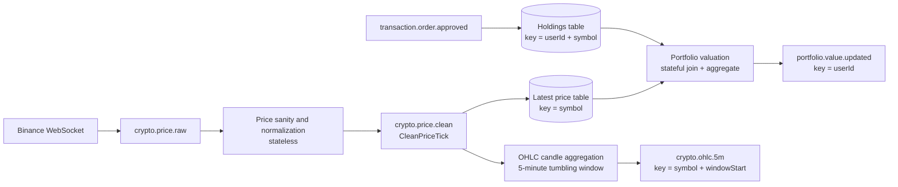

# Market Data Stream Topology Proposal

**Status:** proposal  
**Purpose:** define one coherent stream-processing topology that demonstrates stateless, stateful, and windowed event processing using the existing CryptoFlow market-data stream.

## Summary

Use the existing Binance ingestion in `market-data-service` as the source. It already publishes raw price ticks to `crypto.price.raw`. Add a Kafka Streams topology that derives three business streams from this input:

| Concept | Processor | Input | Output |
|---|---|---|---|
| Stateless | Price sanity and normalization | `crypto.price.raw` | `crypto.price.clean` |
| Stateful | Real-time portfolio valuation | `crypto.price.clean`, `transaction.order.approved` | `portfolio.value.updated` |
| Windowed | 5-minute OHLC candles | `crypto.price.clean` | `crypto.ohlc.5m` |

## Flowchart

## Processor Responsibilities

### 1. Price Sanity and Normalization

This is the stateless stage. Each price tick is handled independently.

Responsibilities:

- Drop malformed events with missing symbol, price, or timestamp.
- Drop impossible prices, for example `price <= 0`.
- Normalize symbol representation, for example consistently using `BTCUSDT` or `BTC-USDT`.
- Add stream metadata such as `sourceVenue = "binance"` and `processedAt`.
- Convert the current JSON event into an Avro-backed `CleanPriceTick` event at the `crypto.price.clean` boundary.

This centralizes checks that are currently scattered across ordinary Spring Kafka consumers.

### 2. Real-Time Portfolio Valuation

This is the stateful stage. It continuously maintains derived state from multiple event streams.

Responsibilities:

- Materialize the latest price per symbol from `crypto.price.clean`.
- Materialize user holdings from `transaction.order.approved`.
- Join holdings with latest prices.
- Compute position values as `quantity * latestPrice`.
- Aggregate positions by `userId`.
- Emit `portfolio.value.updated` whenever a relevant price or holding changes.

This is not portfolio validation. It is continuous portfolio valuation. The value depends on remembered state: latest prices and current holdings.

### 3. OHLC Candle Aggregation

This is the windowed stage. It turns the unbounded price stream into finite 5-minute time buckets.

Responsibilities:

- Group clean ticks by symbol.
- Use event time from the price tick timestamp.
- Apply a 5-minute tumbling window.
- Compute open, high, low, close, and tick count for each symbol/window.
- Emit candles to `crypto.ohlc.5m`.

Late events should be accepted within a small grace period, for example 10-30 seconds. Events later than the grace period can be dropped or routed to a late-event topic.

## Implementation Notes

- Keep `crypto.price.raw` as the replayable source topic.
- Treat `crypto.price.clean` as the canonical downstream price contract.
- Prefer Avro for new derived topics: `crypto.price.clean`, `portfolio.value.updated`, and `crypto.ohlc.5m`.
- The existing in-memory `LocalPriceCache` and REST-time valuation can remain during migration, but the stream topology should become the demonstrated stateful implementation.
- A dedicated streams module or service is preferable to embedding the topology inside form/onboarding workflows.
