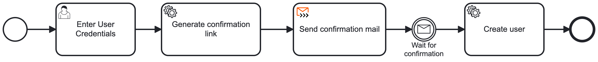
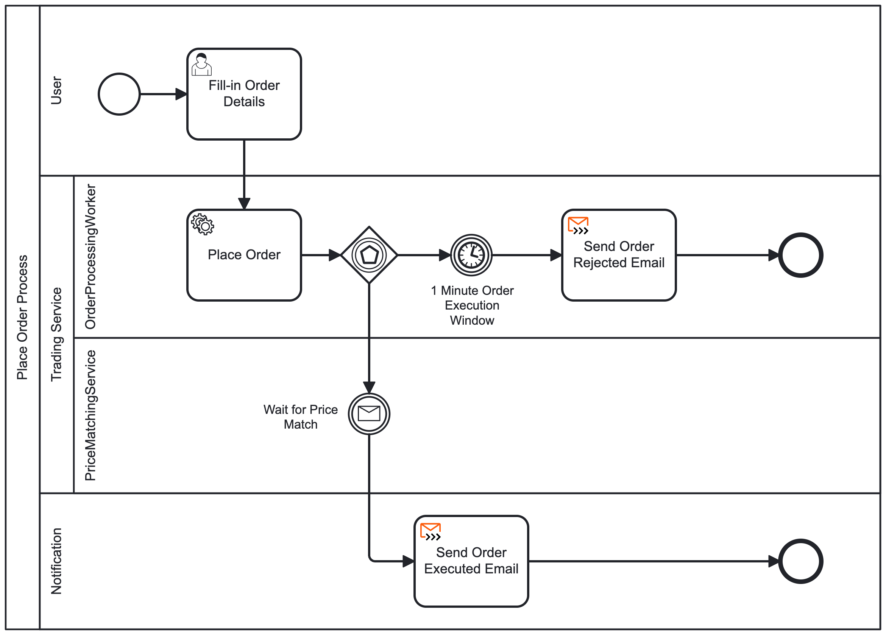

# CryptoFlow BPMN Workflows

> ![NOTE]
> 
> This document describes the BPMN processes deployed to Camunda 8 and argues why these
> specific flows are orchestrated rather than handled through Kafka-based choreography.

Project Link: [https://github.com/cyrilgabriele/EDPO-Project-FS26](https://github.com/cyrilgabriele/EDPO-Project-FS26)

## Orchestration vs. choreography — decision criteria

CryptoFlow uses Kafka-based choreography as its default integration style: services publish
and consume events independently, with no central coordinator. This works well for loosely
coupled interactions where each service can react to events autonomously.

Some processes, however, require a different set of trade-offs that choreography cannot
provide efficiently. A process is a candidate for orchestration when it exhibits one or more
of the following characteristics:

- **Long-running waits with correlation** — the process suspends for an unbounded period and
  must correlate a future event back to a specific in-flight instance.
- **Competing outcomes** — the process races multiple possible events (e.g. a success signal
  vs. a timeout) and must branch accordingly.
- **Strict step ordering with compensation** — steps must execute in a defined sequence, and
  failure at any point requires rolling back earlier steps.
- **Operational visibility** — support or operations need to see exactly where an instance is
  stuck without aggregating events across services.

The Camunda workflow engine handles all of the above declaratively: it owns process state, correlates
messages, manages timeouts and branching, and provides an operations dashboard out of the
box. The processes below were modelled as BPMN workflows in Camunda 8 because they match
these criteria.

---

## 1. User Onboarding

### Why orchestration

Registration requires waiting an unbounded amount of time for the user to click a
confirmation link. With Kafka choreography, the service sending the email and the service
reacting to the confirmation click would need shared state to correlate the two, plus a
separate scheduled job for timeouts — all without a central view of pending registrations.

As an orchestrated BPMN process, the wait is a simple intermediate message catch event. The
engine tracks every pending registration, correlates the confirmation message automatically,
and timeouts can be added as a declarative boundary event.

### Process description

1. **Start event** — a new registration process instance is created.
2. **Enter User Credentials** (user task) — collects username, password, and email.
3. **Generate Confirmation Link** (service task) — generates a unique user ID and builds the
   confirmation URL and email body.
4. **Send Confirmation Mail** (email connector) — sends the confirmation email to the user.
5. **Confirmation Mail Sent Gateway** (event-based gateway) — starts a race between the
   confirmation click and an expiry timer.
6. **Wait for Confirmation** (intermediate message catch event) — the process suspends until
   the user clicks the confirmation link, which publishes a correlated message.
7. **Create User** (service task) — persists the new user.
8. **Confirmation Link Expired** (timer catch event) — fires 45 seconds after the email is
   sent (short for debugging), triggering the **Invalidate Confirmation Link** service task
   that blocks the link inside the user service, after which the process terminates.
9. **End event** — both paths terminate the process instance.

### Future improvements

- **Registration timeout.** Add a timer boundary event on the wait step (e.g. 24 hours) to
  send a reminder email, and cancel the process after a second timeout.
- **Duplicate detection.** Add a gateway before the user task to reject already-registered
  email addresses early.
- **Welcome notification.** After user creation, publish an event so that other services
  (e.g. portfolio) can react to new users.

---

## 2. Place Order

### Why orchestration

An order must wait for a market price to reach the user's target — a wait that can last
seconds to hours and must correlate a specific price event to a specific pending order. In
addition, the flow must race two outcomes: a successful price match or a timeout expiry.

With Kafka choreography, matching state would live inside the service, timeout logic would be
a custom scheduled job, and the race between match and timeout would require hand-written
coordination code. There would be no central view of which orders are pending, matched, or
expired.

As an orchestrated BPMN process, the race is modelled as an event-based gateway — the engine
handles correlation, timeout, and branching declaratively, and every pending order is visible
in the operations dashboard.

### Process description

The process uses four swim lanes to separate concerns:

1. **Start event** — a new order process instance is created.
2. **Fill-in Order Details** (user task) — collects the crypto symbol, amount, and target
   price.
3. **Place Order** (service task) — registers the order as pending and generates a transaction
   ID for downstream correlation.
4. **Event-based gateway** — the process races two competing events:

   **Path A — Price match (happy path):**
   The process waits for a price-matched message correlated by transaction ID. When the
   market price meets or beats the target price for the given symbol, the match is signalled.
   The process then sends an **Order Executed Email** notifying the user of the successful
   execution.

   **Path B — Timeout (rejection path):**
   A 1-minute timer fires if no price match occurs within the execution window. The process
   sends an **Order Rejected Email** notifying the user that the order could not be filled in
   time.

5. **End event** — both paths terminate the process instance.

### Future improvements

- **Configurable execution window.** Let users choose their own timeout duration per order
  instead of a fixed 1 minute.
- **Portfolio integration.** After a price match, publish an event so the portfolio service
  can update the user's holdings.
- **Partial fills and order types.** Extend matching to support partial quantity fills and
  differentiate between market, limit, and stop-loss orders.
